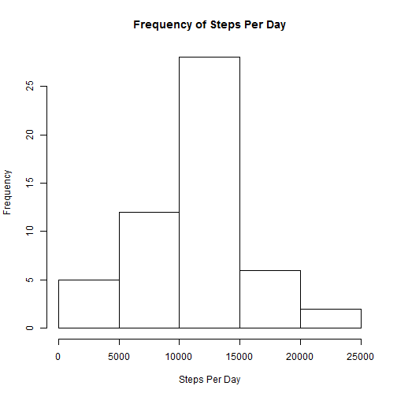
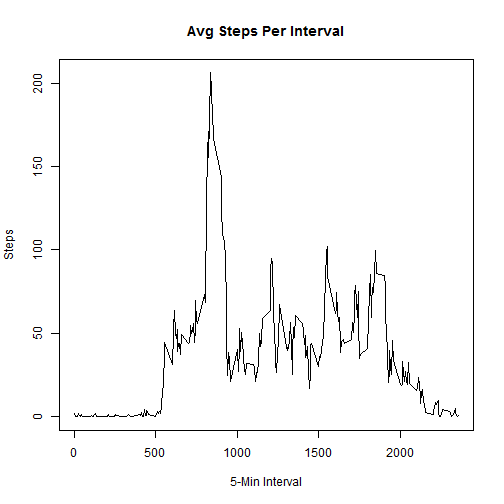
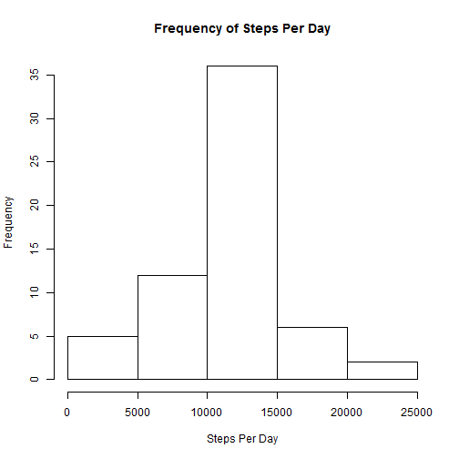

## Loading and preprocessing the data


```r
#Show any code that is needed to
#1. Load the data (i.e. `read.csv()`)
  ## Check if the unzip file exists
  if (!file.exists("activity.csv")) {
    ## unzip the files
    unzip("./activity.zip")
  }
  ## read the data
  df <- read.csv("activity.csv")

#2. Process/transform the data (if necessary) into a format suitable for your analysis
# just look at the data, no transformation needed
summary(df)
```

```
##      steps                date          interval     
##  Min.   :  0.00   2012-10-01:  288   Min.   :   0.0  
##  1st Qu.:  0.00   2012-10-02:  288   1st Qu.: 588.8  
##  Median :  0.00   2012-10-03:  288   Median :1177.5  
##  Mean   : 37.38   2012-10-04:  288   Mean   :1177.5  
##  3rd Qu.: 12.00   2012-10-05:  288   3rd Qu.:1766.2  
##  Max.   :806.00   2012-10-06:  288   Max.   :2355.0  
##  NA's   :2304     (Other)   :15840
```

```r
head(df)
```

```
##   steps       date interval
## 1    NA 2012-10-01        0
## 2    NA 2012-10-01        5
## 3    NA 2012-10-01       10
## 4    NA 2012-10-01       15
## 5    NA 2012-10-01       20
## 6    NA 2012-10-01       25
```

```r
tail(df)
```

```
##       steps       date interval
## 17563    NA 2012-11-30     2330
## 17564    NA 2012-11-30     2335
## 17565    NA 2012-11-30     2340
## 17566    NA 2012-11-30     2345
## 17567    NA 2012-11-30     2350
## 17568    NA 2012-11-30     2355
```
## What is mean total number of steps taken per day?

```r
#For this part of the assignment, you can ignore the missing values in the dataset.
#1. Make a histogram of the total number of steps taken each day
dfStepsPerDay <- aggregate(df$steps, by=list(df$date), FUN=sum, na.rm=FALSE)
hist(dfStepsPerDay$x, xlab="Steps Per Day", main="Frequency of Steps Per Day")
```

 

```r
#2. Calculate and report the **mean** and **median** total number of steps taken per day
mean(dfStepsPerDay$x, na.rm=TRUE)
```

```
## [1] 10766.19
```

```r
median(dfStepsPerDay$x, na.rm=TRUE)
```

```
## [1] 10765
```
## What is the average daily activity pattern?

```r
#1. Make a time series plot (i.e. `type = "l"`) of the 5-minute interval (x-axis) and the average number of steps taken, averaged across all days (y-axis)
dfStepsPerInterval <- aggregate(df$steps, by=list(df$interval), FUN=mean, na.rm=TRUE)
plot(dfStepsPerInterval, type="l", xlab="5-Min Interval", ylab="Steps", main="Avg Steps Per Interval")
```

 

```r
#2. Which 5-minute interval, on average across all the days in the dataset, contains the maximum number of steps?
dfMax <- subset(dfStepsPerInterval, x == max(dfStepsPerInterval$x))
dfMax$Group.1
```

```
## [1] 835
```
## Imputing missing values

```r
#Note that there are a number of days/intervals where there are missing
#values (coded as `NA`). The presence of missing days may introduce
#bias into some calculations or summaries of the data.

#1. Calculate and report the total number of missing values in the dataset (i.e. the total number of rows with `NA`s)
length(which(is.na(df$steps)==T))
```

```
## [1] 2304
```

```r
#2. Devise a strategy for filling in all of the missing values in the dataset. The strategy does not need to be sophisticated. For example, you could use the mean/median for that day, or the mean for that 5-minute interval, etc.
## My Strategy:  use the mean for that 5-minute interval to fill the missing data

#3. Create a new dataset that is equal to the original dataset but with the missing data filled in.
# create a dataframe for the missing numbers
dfMissing <- subset(df, is.na(df$steps))
# merge the missing dataframe with the avg steps per interval dataframe previously created
dfMergedMissing <- merge(dfMissing, dfStepsPerInterval, by.x="interval", by.y="Group.1")
# remove the column with NA - steps
dfMergedMissing <- subset(dfMergedMissing, select=c("x", "date", "interval"))
# merge the updated missing data with the original dataframe
dfNoMissing <- merge(df, dfMergedMissing, by.x=c("interval","date"), by.y=c("interval","date"), all.x=TRUE)
# update steps to the value of x where it is NA
dfNoMissing$steps[is.na(dfNoMissing$steps)] <- dfNoMissing$x[is.na(dfNoMissing$steps)]
# drop the x column
dfNoMissing <- subset(dfNoMissing, select=c("steps", "date", "interval"))
# order by date and then by interval
dfNoMissing <- dfNoMissing[with(dfNoMissing, order(date, interval)), ]
dfNoMissing
```

```
##             steps       date interval
## 1       1.7169811 2012-10-01        0
## 62      0.3396226 2012-10-01        5
## 123     0.1320755 2012-10-01       10
## 184     0.1509434 2012-10-01       15
## 245     0.0754717 2012-10-01       20
## 306     2.0943396 2012-10-01       25
## 367     0.5283019 2012-10-01       30
## 428     0.8679245 2012-10-01       35
## 489     0.0000000 2012-10-01       40
## 550     1.4716981 2012-10-01       45
## 611     0.3018868 2012-10-01       50
## 672     0.1320755 2012-10-01       55
## 733     0.3207547 2012-10-01      100
## 794     0.6792453 2012-10-01      105
## 855     0.1509434 2012-10-01      110
## 916     0.3396226 2012-10-01      115
## 977     0.0000000 2012-10-01      120
## 1038    1.1132075 2012-10-01      125
## 1099    1.8301887 2012-10-01      130
## 1160    0.1698113 2012-10-01      135
## 1221    0.1698113 2012-10-01      140
## 1282    0.3773585 2012-10-01      145
## 1343    0.2641509 2012-10-01      150
## 1404    0.0000000 2012-10-01      155
## 1465    0.0000000 2012-10-01      200
## 1526    0.0000000 2012-10-01      205
## 1587    1.1320755 2012-10-01      210
## 1648    0.0000000 2012-10-01      215
## 1709    0.0000000 2012-10-01      220
## 1770    0.1320755 2012-10-01      225
## 1831    0.0000000 2012-10-01      230
## 1892    0.2264151 2012-10-01      235
## 1953    0.0000000 2012-10-01      240
## 2014    0.0000000 2012-10-01      245
## 2075    1.5471698 2012-10-01      250
## 2136    0.9433962 2012-10-01      255
## 2197    0.0000000 2012-10-01      300
## 2258    0.0000000 2012-10-01      305
## 2319    0.0000000 2012-10-01      310
## 2380    0.0000000 2012-10-01      315
## 2441    0.2075472 2012-10-01      320
## 2502    0.6226415 2012-10-01      325
## 2563    1.6226415 2012-10-01      330
## 2624    0.5849057 2012-10-01      335
## 2685    0.4905660 2012-10-01      340
## 2746    0.0754717 2012-10-01      345
## 2807    0.0000000 2012-10-01      350
## 2868    0.0000000 2012-10-01      355
## 2929    1.1886792 2012-10-01      400
## 2990    0.9433962 2012-10-01      405
## 3051    2.5660377 2012-10-01      410
## 3112    0.0000000 2012-10-01      415
## 3173    0.3396226 2012-10-01      420
## 3234    0.3584906 2012-10-01      425
## 3295    4.1132075 2012-10-01      430
## 3356    0.6603774 2012-10-01      435
## 3417    3.4905660 2012-10-01      440
## 3478    0.8301887 2012-10-01      445
## 3539    3.1132075 2012-10-01      450
## 3600    1.1132075 2012-10-01      455
## 3661    0.0000000 2012-10-01      500
## 3722    1.5660377 2012-10-01      505
## 3783    3.0000000 2012-10-01      510
## 3844    2.2452830 2012-10-01      515
## 3905    3.3207547 2012-10-01      520
## 3966    2.9622642 2012-10-01      525
## 4027    2.0943396 2012-10-01      530
## 4088    6.0566038 2012-10-01      535
## 4149   16.0188679 2012-10-01      540
## 4210   18.3396226 2012-10-01      545
## 4271   39.4528302 2012-10-01      550
## 4332   44.4905660 2012-10-01      555
## 4393   31.4905660 2012-10-01      600
## 4454   49.2641509 2012-10-01      605
## 4515   53.7735849 2012-10-01      610
## 4576   63.4528302 2012-10-01      615
## 4637   49.9622642 2012-10-01      620
## 4698   47.0754717 2012-10-01      625
## 4759   52.1509434 2012-10-01      630
## 4820   39.3396226 2012-10-01      635
## 4881   44.0188679 2012-10-01      640
## 4942   44.1698113 2012-10-01      645
## 5003   37.3584906 2012-10-01      650
## 5064   49.0377358 2012-10-01      655
## 5125   43.8113208 2012-10-01      700
## 5186   44.3773585 2012-10-01      705
## 5247   50.5094340 2012-10-01      710
## 5308   54.5094340 2012-10-01      715
## 5369   49.9245283 2012-10-01      720
## 5430   50.9811321 2012-10-01      725
## 5491   55.6792453 2012-10-01      730
## 5552   44.3207547 2012-10-01      735
## 5613   52.2641509 2012-10-01      740
## 5674   69.5471698 2012-10-01      745
## 5735   57.8490566 2012-10-01      750
## 5796   56.1509434 2012-10-01      755
## 5857   73.3773585 2012-10-01      800
## 5918   68.2075472 2012-10-01      805
## 5979  129.4339623 2012-10-01      810
## 6040  157.5283019 2012-10-01      815
## 6101  171.1509434 2012-10-01      820
## 6162  155.3962264 2012-10-01      825
## 6223  177.3018868 2012-10-01      830
## 6284  206.1698113 2012-10-01      835
## 6345  195.9245283 2012-10-01      840
## 6406  179.5660377 2012-10-01      845
## 6467  183.3962264 2012-10-01      850
## 6528  167.0188679 2012-10-01      855
## 6589  143.4528302 2012-10-01      900
## 6650  124.0377358 2012-10-01      905
## 6711  109.1132075 2012-10-01      910
## 6772  108.1132075 2012-10-01      915
## 6833  103.7169811 2012-10-01      920
## 6894   95.9622642 2012-10-01      925
## 6955   66.2075472 2012-10-01      930
## 7016   45.2264151 2012-10-01      935
## 7077   24.7924528 2012-10-01      940
## 7138   38.7547170 2012-10-01      945
## 7199   34.9811321 2012-10-01      950
## 7260   21.0566038 2012-10-01      955
## 7321   40.5660377 2012-10-01     1000
## 7382   26.9811321 2012-10-01     1005
## 7443   42.4150943 2012-10-01     1010
## 7504   52.6603774 2012-10-01     1015
## 7565   38.9245283 2012-10-01     1020
## 7626   50.7924528 2012-10-01     1025
## 7687   44.2830189 2012-10-01     1030
## 7748   37.4150943 2012-10-01     1035
## 7809   34.6981132 2012-10-01     1040
## 7870   28.3396226 2012-10-01     1045
## 7931   25.0943396 2012-10-01     1050
## 7992   31.9433962 2012-10-01     1055
## 8053   31.3584906 2012-10-01     1100
## 8114   29.6792453 2012-10-01     1105
## 8175   21.3207547 2012-10-01     1110
## 8236   25.5471698 2012-10-01     1115
## 8297   28.3773585 2012-10-01     1120
## 8358   26.4716981 2012-10-01     1125
## 8419   33.4339623 2012-10-01     1130
## 8480   49.9811321 2012-10-01     1135
## 8541   42.0377358 2012-10-01     1140
## 8602   44.6037736 2012-10-01     1145
## 8663   46.0377358 2012-10-01     1150
## 8724   59.1886792 2012-10-01     1155
## 8785   63.8679245 2012-10-01     1200
## 8846   87.6981132 2012-10-01     1205
## 8907   94.8490566 2012-10-01     1210
## 8968   92.7735849 2012-10-01     1215
## 9029   63.3962264 2012-10-01     1220
## 9090   50.1698113 2012-10-01     1225
## 9151   54.4716981 2012-10-01     1230
## 9212   32.4150943 2012-10-01     1235
## 9273   26.5283019 2012-10-01     1240
## 9334   37.7358491 2012-10-01     1245
## 9395   45.0566038 2012-10-01     1250
## 9456   67.2830189 2012-10-01     1255
## 9517   42.3396226 2012-10-01     1300
## 9578   39.8867925 2012-10-01     1305
## 9639   43.2641509 2012-10-01     1310
## 9700   40.9811321 2012-10-01     1315
## 9761   46.2452830 2012-10-01     1320
## 9822   56.4339623 2012-10-01     1325
## 9883   42.7547170 2012-10-01     1330
## 9944   25.1320755 2012-10-01     1335
## 10005  39.9622642 2012-10-01     1340
## 10066  53.5471698 2012-10-01     1345
## 10127  47.3207547 2012-10-01     1350
## 10188  60.8113208 2012-10-01     1355
## 10249  55.7547170 2012-10-01     1400
## 10310  51.9622642 2012-10-01     1405
## 10371  43.5849057 2012-10-01     1410
## 10432  48.6981132 2012-10-01     1415
## 10493  35.4716981 2012-10-01     1420
## 10554  37.5471698 2012-10-01     1425
## 10615  41.8490566 2012-10-01     1430
## 10676  27.5094340 2012-10-01     1435
## 10737  17.1132075 2012-10-01     1440
## 10798  26.0754717 2012-10-01     1445
## 10859  43.6226415 2012-10-01     1450
## 10920  43.7735849 2012-10-01     1455
## 10981  30.0188679 2012-10-01     1500
## 11042  36.0754717 2012-10-01     1505
## 11103  35.4905660 2012-10-01     1510
## 11164  38.8490566 2012-10-01     1515
## 11225  45.9622642 2012-10-01     1520
## 11286  47.7547170 2012-10-01     1525
## 11347  48.1320755 2012-10-01     1530
## 11408  65.3207547 2012-10-01     1535
## 11469  82.9056604 2012-10-01     1540
## 11530  98.6603774 2012-10-01     1545
## 11591 102.1132075 2012-10-01     1550
## 11652  83.9622642 2012-10-01     1555
## 11713  62.1320755 2012-10-01     1600
## 11774  64.1320755 2012-10-01     1605
## 11835  74.5471698 2012-10-01     1610
## 11896  63.1698113 2012-10-01     1615
## 11957  56.9056604 2012-10-01     1620
## 12018  59.7735849 2012-10-01     1625
## 12079  43.8679245 2012-10-01     1630
## 12140  38.5660377 2012-10-01     1635
## 12201  44.6603774 2012-10-01     1640
## 12262  45.4528302 2012-10-01     1645
## 12323  46.2075472 2012-10-01     1650
## 12384  43.6792453 2012-10-01     1655
## 12445  46.6226415 2012-10-01     1700
## 12506  56.3018868 2012-10-01     1705
## 12567  50.7169811 2012-10-01     1710
## 12628  61.2264151 2012-10-01     1715
## 12689  72.7169811 2012-10-01     1720
## 12750  78.9433962 2012-10-01     1725
## 12811  68.9433962 2012-10-01     1730
## 12872  59.6603774 2012-10-01     1735
## 12933  75.0943396 2012-10-01     1740
## 12994  56.5094340 2012-10-01     1745
## 13055  34.7735849 2012-10-01     1750
## 13116  37.4528302 2012-10-01     1755
## 13177  40.6792453 2012-10-01     1800
## 13238  58.0188679 2012-10-01     1805
## 13299  74.6981132 2012-10-01     1810
## 13360  85.3207547 2012-10-01     1815
## 13421  59.2641509 2012-10-01     1820
## 13482  67.7735849 2012-10-01     1825
## 13543  77.6981132 2012-10-01     1830
## 13604  74.2452830 2012-10-01     1835
## 13665  85.3396226 2012-10-01     1840
## 13726  99.4528302 2012-10-01     1845
## 13787  86.5849057 2012-10-01     1850
## 13848  85.6037736 2012-10-01     1855
## 13909  84.8679245 2012-10-01     1900
## 13970  77.8301887 2012-10-01     1905
## 14031  58.0377358 2012-10-01     1910
## 14092  53.3584906 2012-10-01     1915
## 14153  36.3207547 2012-10-01     1920
## 14214  20.7169811 2012-10-01     1925
## 14275  27.3962264 2012-10-01     1930
## 14336  40.0188679 2012-10-01     1935
## 14397  30.2075472 2012-10-01     1940
## 14458  25.5471698 2012-10-01     1945
## 14519  45.6603774 2012-10-01     1950
## 14580  33.5283019 2012-10-01     1955
## 14641  19.6226415 2012-10-01     2000
## 14702  19.0188679 2012-10-01     2005
## 14763  19.3396226 2012-10-01     2010
## 14824  33.3396226 2012-10-01     2015
## 14885  26.8113208 2012-10-01     2020
## 14946  21.1698113 2012-10-01     2025
## 15007  27.3018868 2012-10-01     2030
## 15068  21.3396226 2012-10-01     2035
## 15129  19.5471698 2012-10-01     2040
## 15190  21.3207547 2012-10-01     2045
## 15251  32.3018868 2012-10-01     2050
## 15312  20.1509434 2012-10-01     2055
## 15373  15.9433962 2012-10-01     2100
## 15434  17.2264151 2012-10-01     2105
## 15495  23.4528302 2012-10-01     2110
## 15556  19.2452830 2012-10-01     2115
## 15617  12.4528302 2012-10-01     2120
## 15678   8.0188679 2012-10-01     2125
## 15739  14.6603774 2012-10-01     2130
## 15800  16.3018868 2012-10-01     2135
## 15861   8.6792453 2012-10-01     2140
## 15922   7.7924528 2012-10-01     2145
## 15983   8.1320755 2012-10-01     2150
## 16044   2.6226415 2012-10-01     2155
## 16105   1.4528302 2012-10-01     2200
## 16166   3.6792453 2012-10-01     2205
## 16227   4.8113208 2012-10-01     2210
## 16288   8.5094340 2012-10-01     2215
## 16349   7.0754717 2012-10-01     2220
## 16410   8.6981132 2012-10-01     2225
## 16471   9.7547170 2012-10-01     2230
## 16532   2.2075472 2012-10-01     2235
## 16593   0.3207547 2012-10-01     2240
## 16654   0.1132075 2012-10-01     2245
## 16715   1.6037736 2012-10-01     2250
## 16776   4.6037736 2012-10-01     2255
## 16837   3.3018868 2012-10-01     2300
## 16898   2.8490566 2012-10-01     2305
## 16959   0.0000000 2012-10-01     2310
## 17020   0.8301887 2012-10-01     2315
## 17081   0.9622642 2012-10-01     2320
## 17142   1.5849057 2012-10-01     2325
## 17203   2.6037736 2012-10-01     2330
## 17264   4.6981132 2012-10-01     2335
## 17325   3.3018868 2012-10-01     2340
## 17386   0.6415094 2012-10-01     2345
## 17447   0.2264151 2012-10-01     2350
## 17508   1.0754717 2012-10-01     2355
## 2       0.0000000 2012-10-02        0
## 63      0.0000000 2012-10-02        5
## 124     0.0000000 2012-10-02       10
## 185     0.0000000 2012-10-02       15
## 246     0.0000000 2012-10-02       20
## 307     0.0000000 2012-10-02       25
## 368     0.0000000 2012-10-02       30
## 429     0.0000000 2012-10-02       35
## 490     0.0000000 2012-10-02       40
## 551     0.0000000 2012-10-02       45
## 612     0.0000000 2012-10-02       50
## 673     0.0000000 2012-10-02       55
## 734     0.0000000 2012-10-02      100
## 795     0.0000000 2012-10-02      105
## 856     0.0000000 2012-10-02      110
## 917     0.0000000 2012-10-02      115
## 978     0.0000000 2012-10-02      120
## 1039    0.0000000 2012-10-02      125
## 1100    0.0000000 2012-10-02      130
## 1161    0.0000000 2012-10-02      135
## 1222    0.0000000 2012-10-02      140
## 1283    0.0000000 2012-10-02      145
## 1344    0.0000000 2012-10-02      150
## 1405    0.0000000 2012-10-02      155
## 1466    0.0000000 2012-10-02      200
## 1527    0.0000000 2012-10-02      205
## 1588    0.0000000 2012-10-02      210
## 1649    0.0000000 2012-10-02      215
## 1710    0.0000000 2012-10-02      220
## 1771    0.0000000 2012-10-02      225
## 1832    0.0000000 2012-10-02      230
## 1893    0.0000000 2012-10-02      235
## 1954    0.0000000 2012-10-02      240
## 2015    0.0000000 2012-10-02      245
## 2076    0.0000000 2012-10-02      250
## 2137    0.0000000 2012-10-02      255
## 2198    0.0000000 2012-10-02      300
## 2259    0.0000000 2012-10-02      305
## 2320    0.0000000 2012-10-02      310
## 2381    0.0000000 2012-10-02      315
## 2442    0.0000000 2012-10-02      320
## 2503    0.0000000 2012-10-02      325
## 2564    0.0000000 2012-10-02      330
## 2625    0.0000000 2012-10-02      335
## 2686    0.0000000 2012-10-02      340
## 2747    0.0000000 2012-10-02      345
## 2808    0.0000000 2012-10-02      350
## 2869    0.0000000 2012-10-02      355
## 2930    0.0000000 2012-10-02      400
## 2991    0.0000000 2012-10-02      405
## 3052    0.0000000 2012-10-02      410
## 3113    0.0000000 2012-10-02      415
## 3174    0.0000000 2012-10-02      420
## 3235    0.0000000 2012-10-02      425
## 3296    0.0000000 2012-10-02      430
## 3357    0.0000000 2012-10-02      435
## 3418    0.0000000 2012-10-02      440
## 3479    0.0000000 2012-10-02      445
## 3540    0.0000000 2012-10-02      450
## 3601    0.0000000 2012-10-02      455
## 3662    0.0000000 2012-10-02      500
## 3723    0.0000000 2012-10-02      505
## 3784    0.0000000 2012-10-02      510
## 3845    0.0000000 2012-10-02      515
## 3906    0.0000000 2012-10-02      520
## 3967    0.0000000 2012-10-02      525
## 4028    0.0000000 2012-10-02      530
## 4089    0.0000000 2012-10-02      535
## 4150    0.0000000 2012-10-02      540
## 4211    0.0000000 2012-10-02      545
## 4272    0.0000000 2012-10-02      550
## 4333    0.0000000 2012-10-02      555
## 4394    0.0000000 2012-10-02      600
## 4455    0.0000000 2012-10-02      605
## 4516    0.0000000 2012-10-02      610
## 4577    0.0000000 2012-10-02      615
## 4638    0.0000000 2012-10-02      620
## 4699    0.0000000 2012-10-02      625
## 4760    0.0000000 2012-10-02      630
## 4821    0.0000000 2012-10-02      635
## 4882    0.0000000 2012-10-02      640
## 4943    0.0000000 2012-10-02      645
## 5004    0.0000000 2012-10-02      650
## 5065    0.0000000 2012-10-02      655
## 5126    0.0000000 2012-10-02      700
## 5187    0.0000000 2012-10-02      705
## 5248    0.0000000 2012-10-02      710
## 5309    0.0000000 2012-10-02      715
## 5370    0.0000000 2012-10-02      720
## 5431    0.0000000 2012-10-02      725
## 5492    0.0000000 2012-10-02      730
## 5553    0.0000000 2012-10-02      735
## 5614    0.0000000 2012-10-02      740
## 5675    0.0000000 2012-10-02      745
## 5736    0.0000000 2012-10-02      750
## 5797    0.0000000 2012-10-02      755
## 5858    0.0000000 2012-10-02      800
## 5919    0.0000000 2012-10-02      805
## 5980    0.0000000 2012-10-02      810
## 6041    0.0000000 2012-10-02      815
## 6102    0.0000000 2012-10-02      820
## 6163    0.0000000 2012-10-02      825
## 6224    0.0000000 2012-10-02      830
## 6285    0.0000000 2012-10-02      835
## 6346    0.0000000 2012-10-02      840
## 6407    0.0000000 2012-10-02      845
## 6468    0.0000000 2012-10-02      850
## 6529    0.0000000 2012-10-02      855
## 6590    0.0000000 2012-10-02      900
## 6651    0.0000000 2012-10-02      905
## 6712    0.0000000 2012-10-02      910
## 6773    0.0000000 2012-10-02      915
## 6834    0.0000000 2012-10-02      920
## 6895    0.0000000 2012-10-02      925
## 6956    0.0000000 2012-10-02      930
## 7017    0.0000000 2012-10-02      935
## 7078    0.0000000 2012-10-02      940
## 7139    0.0000000 2012-10-02      945
## 7200    0.0000000 2012-10-02      950
## 7261    0.0000000 2012-10-02      955
## 7322    0.0000000 2012-10-02     1000
## 7383    0.0000000 2012-10-02     1005
## 7444    0.0000000 2012-10-02     1010
## 7505    0.0000000 2012-10-02     1015
## 7566    0.0000000 2012-10-02     1020
## 7627    0.0000000 2012-10-02     1025
## 7688    0.0000000 2012-10-02     1030
## 7749    0.0000000 2012-10-02     1035
## 7810    0.0000000 2012-10-02     1040
## 7871    0.0000000 2012-10-02     1045
## 7932    0.0000000 2012-10-02     1050
## 7993    0.0000000 2012-10-02     1055
## 8054    0.0000000 2012-10-02     1100
## 8115    0.0000000 2012-10-02     1105
## 8176    0.0000000 2012-10-02     1110
## 8237    0.0000000 2012-10-02     1115
## 8298    0.0000000 2012-10-02     1120
## 8359    0.0000000 2012-10-02     1125
## 8420    0.0000000 2012-10-02     1130
## 8481    0.0000000 2012-10-02     1135
## 8542    0.0000000 2012-10-02     1140
## 8603    0.0000000 2012-10-02     1145
## 8664    0.0000000 2012-10-02     1150
## 8725    0.0000000 2012-10-02     1155
## 8786    0.0000000 2012-10-02     1200
## 8847    0.0000000 2012-10-02     1205
## 8908    0.0000000 2012-10-02     1210
## 8969    0.0000000 2012-10-02     1215
## 9030    0.0000000 2012-10-02     1220
## 9091    0.0000000 2012-10-02     1225
## 9152    0.0000000 2012-10-02     1230
## 9213    0.0000000 2012-10-02     1235
## 9274    0.0000000 2012-10-02     1240
## 9335    0.0000000 2012-10-02     1245
## 9396    0.0000000 2012-10-02     1250
## 9457    0.0000000 2012-10-02     1255
## 9518    0.0000000 2012-10-02     1300
## 9579    0.0000000 2012-10-02     1305
## 9640    0.0000000 2012-10-02     1310
## 9701    0.0000000 2012-10-02     1315
## 9762    0.0000000 2012-10-02     1320
## 9823    0.0000000 2012-10-02     1325
## 9884    0.0000000 2012-10-02     1330
## 9945    0.0000000 2012-10-02     1335
## 10006   0.0000000 2012-10-02     1340
## 10067   0.0000000 2012-10-02     1345
## 10128   0.0000000 2012-10-02     1350
## 10189   0.0000000 2012-10-02     1355
## 10250   0.0000000 2012-10-02     1400
## 10311   0.0000000 2012-10-02     1405
## 10372   0.0000000 2012-10-02     1410
## 10433   0.0000000 2012-10-02     1415
## 10494   0.0000000 2012-10-02     1420
## 10555   0.0000000 2012-10-02     1425
## 10616   0.0000000 2012-10-02     1430
## 10677   0.0000000 2012-10-02     1435
## 10738   0.0000000 2012-10-02     1440
## 10799   0.0000000 2012-10-02     1445
## 10860   0.0000000 2012-10-02     1450
## 10921   0.0000000 2012-10-02     1455
## 10982   0.0000000 2012-10-02     1500
## 11043   0.0000000 2012-10-02     1505
## 11104   0.0000000 2012-10-02     1510
## 11165   0.0000000 2012-10-02     1515
## 11226   0.0000000 2012-10-02     1520
## 11287   0.0000000 2012-10-02     1525
## 11348   0.0000000 2012-10-02     1530
## 11409   0.0000000 2012-10-02     1535
## 11470   0.0000000 2012-10-02     1540
## 11531   0.0000000 2012-10-02     1545
## 11592   0.0000000 2012-10-02     1550
## 11653   0.0000000 2012-10-02     1555
## 11714   0.0000000 2012-10-02     1600
## 11775   0.0000000 2012-10-02     1605
## 11836   0.0000000 2012-10-02     1610
## 11897   0.0000000 2012-10-02     1615
## 11958   0.0000000 2012-10-02     1620
## 12019   0.0000000 2012-10-02     1625
## 12080   0.0000000 2012-10-02     1630
## 12141   0.0000000 2012-10-02     1635
## 12202   0.0000000 2012-10-02     1640
## 12263   0.0000000 2012-10-02     1645
## 12324   0.0000000 2012-10-02     1650
## 12385   0.0000000 2012-10-02     1655
## 12446   0.0000000 2012-10-02     1700
## 12507   0.0000000 2012-10-02     1705
## 12568   0.0000000 2012-10-02     1710
## 12629   0.0000000 2012-10-02     1715
## 12690   0.0000000 2012-10-02     1720
## 12751   0.0000000 2012-10-02     1725
## 12812   0.0000000 2012-10-02     1730
## 12873   0.0000000 2012-10-02     1735
## 12934   0.0000000 2012-10-02     1740
## 12995   0.0000000 2012-10-02     1745
## 13056   0.0000000 2012-10-02     1750
## 13117   0.0000000 2012-10-02     1755
## 13178   0.0000000 2012-10-02     1800
## 13239   0.0000000 2012-10-02     1805
## 13300   0.0000000 2012-10-02     1810
## 13361   0.0000000 2012-10-02     1815
## 13422   0.0000000 2012-10-02     1820
## 13483   0.0000000 2012-10-02     1825
## 13544   0.0000000 2012-10-02     1830
## 13605   0.0000000 2012-10-02     1835
## 13666   0.0000000 2012-10-02     1840
## 13727   0.0000000 2012-10-02     1845
## 13788   0.0000000 2012-10-02     1850
## 13849   0.0000000 2012-10-02     1855
## 13910   0.0000000 2012-10-02     1900
## 13971   0.0000000 2012-10-02     1905
## 14032   0.0000000 2012-10-02     1910
## 14093   0.0000000 2012-10-02     1915
## 14154   0.0000000 2012-10-02     1920
## 14215   0.0000000 2012-10-02     1925
## 14276   0.0000000 2012-10-02     1930
## 14337   0.0000000 2012-10-02     1935
## 14398   0.0000000 2012-10-02     1940
## 14459   0.0000000 2012-10-02     1945
## 14520   0.0000000 2012-10-02     1950
## 14581   0.0000000 2012-10-02     1955
## 14642   0.0000000 2012-10-02     2000
## 14703   0.0000000 2012-10-02     2005
## 14764   0.0000000 2012-10-02     2010
## 14825   0.0000000 2012-10-02     2015
## 14886   0.0000000 2012-10-02     2020
## 14947   0.0000000 2012-10-02     2025
## 15008   0.0000000 2012-10-02     2030
## 15069   0.0000000 2012-10-02     2035
## 15130   0.0000000 2012-10-02     2040
## 15191   0.0000000 2012-10-02     2045
## 15252   0.0000000 2012-10-02     2050
## 15313   0.0000000 2012-10-02     2055
## 15374   0.0000000 2012-10-02     2100
## 15435   0.0000000 2012-10-02     2105
## 15496   0.0000000 2012-10-02     2110
## 15557   0.0000000 2012-10-02     2115
## 15618   0.0000000 2012-10-02     2120
## 15679   0.0000000 2012-10-02     2125
## 15740   0.0000000 2012-10-02     2130
## 15801   0.0000000 2012-10-02     2135
## 15862   0.0000000 2012-10-02     2140
## 15923   0.0000000 2012-10-02     2145
## 15984   0.0000000 2012-10-02     2150
## 16045   0.0000000 2012-10-02     2155
## 16106   0.0000000 2012-10-02     2200
## 16167   0.0000000 2012-10-02     2205
## 16228 117.0000000 2012-10-02     2210
## 16289   9.0000000 2012-10-02     2215
## 16350   0.0000000 2012-10-02     2220
## 16411   0.0000000 2012-10-02     2225
## 16472   0.0000000 2012-10-02     2230
## 16533   0.0000000 2012-10-02     2235
## 16594   0.0000000 2012-10-02     2240
## 16655   0.0000000 2012-10-02     2245
## 16716   0.0000000 2012-10-02     2250
## 16777   0.0000000 2012-10-02     2255
## 16838   0.0000000 2012-10-02     2300
## 16899   0.0000000 2012-10-02     2305
## 16960   0.0000000 2012-10-02     2310
## 17021   0.0000000 2012-10-02     2315
## 17082   0.0000000 2012-10-02     2320
## 17143   0.0000000 2012-10-02     2325
## 17204   0.0000000 2012-10-02     2330
## 17265   0.0000000 2012-10-02     2335
## 17326   0.0000000 2012-10-02     2340
## 17387   0.0000000 2012-10-02     2345
## 17448   0.0000000 2012-10-02     2350
## 17509   0.0000000 2012-10-02     2355
## 3       0.0000000 2012-10-03        0
## 64      0.0000000 2012-10-03        5
## 125     0.0000000 2012-10-03       10
## 186     0.0000000 2012-10-03       15
## 247     0.0000000 2012-10-03       20
## 308     0.0000000 2012-10-03       25
## 369     0.0000000 2012-10-03       30
## 430     0.0000000 2012-10-03       35
## 491     0.0000000 2012-10-03       40
## 552     0.0000000 2012-10-03       45
## 613     0.0000000 2012-10-03       50
## 674     0.0000000 2012-10-03       55
## 735     0.0000000 2012-10-03      100
## 796     0.0000000 2012-10-03      105
## 857     0.0000000 2012-10-03      110
## 918     0.0000000 2012-10-03      115
## 979     0.0000000 2012-10-03      120
## 1040    0.0000000 2012-10-03      125
## 1101    0.0000000 2012-10-03      130
## 1162    0.0000000 2012-10-03      135
## 1223    0.0000000 2012-10-03      140
## 1284    0.0000000 2012-10-03      145
## 1345    0.0000000 2012-10-03      150
## 1406    0.0000000 2012-10-03      155
## 1467    0.0000000 2012-10-03      200
## 1528    0.0000000 2012-10-03      205
## 1589    0.0000000 2012-10-03      210
## 1650    0.0000000 2012-10-03      215
## 1711    0.0000000 2012-10-03      220
## 1772    0.0000000 2012-10-03      225
## 1833    0.0000000 2012-10-03      230
## 1894    0.0000000 2012-10-03      235
## 1955    0.0000000 2012-10-03      240
## 2016    0.0000000 2012-10-03      245
## 2077    0.0000000 2012-10-03      250
## 2138    0.0000000 2012-10-03      255
## 2199    0.0000000 2012-10-03      300
## 2260    0.0000000 2012-10-03      305
## 2321    0.0000000 2012-10-03      310
## 2382    0.0000000 2012-10-03      315
## 2443    0.0000000 2012-10-03      320
## 2504    0.0000000 2012-10-03      325
## 2565    0.0000000 2012-10-03      330
## 2626    0.0000000 2012-10-03      335
## 2687    0.0000000 2012-10-03      340
## 2748    0.0000000 2012-10-03      345
## 2809    0.0000000 2012-10-03      350
## 2870    0.0000000 2012-10-03      355
## 2931    0.0000000 2012-10-03      400
## 2992    0.0000000 2012-10-03      405
## 3053    4.0000000 2012-10-03      410
## 3114    0.0000000 2012-10-03      415
## 3175    0.0000000 2012-10-03      420
## 3236    0.0000000 2012-10-03      425
## 3297   36.0000000 2012-10-03      430
## 3358    0.0000000 2012-10-03      435
## 3419    0.0000000 2012-10-03      440
## 3480    0.0000000 2012-10-03      445
## 3541    0.0000000 2012-10-03      450
## 3602    0.0000000 2012-10-03      455
## 3663    0.0000000 2012-10-03      500
## 3724    0.0000000 2012-10-03      505
## 3785    0.0000000 2012-10-03      510
## 3846    0.0000000 2012-10-03      515
## 3907    0.0000000 2012-10-03      520
## 3968    0.0000000 2012-10-03      525
## 4029    0.0000000 2012-10-03      530
## 4090   25.0000000 2012-10-03      535
## 4151    0.0000000 2012-10-03      540
## 4212    0.0000000 2012-10-03      545
## 4273   90.0000000 2012-10-03      550
## 4334  411.0000000 2012-10-03      555
## 4395  413.0000000 2012-10-03      600
## 4456  415.0000000 2012-10-03      605
## 4517  519.0000000 2012-10-03      610
## 4578  529.0000000 2012-10-03      615
## 4639  613.0000000 2012-10-03      620
## 4700  562.0000000 2012-10-03      625
## 4761  612.0000000 2012-10-03      630
## 4822  534.0000000 2012-10-03      635
## 4883  323.0000000 2012-10-03      640
## 4944  600.0000000 2012-10-03      645
## 5005  533.0000000 2012-10-03      650
## 5066  251.0000000 2012-10-03      655
## 5127   56.0000000 2012-10-03      700
## 5188    0.0000000 2012-10-03      705
## 5249   32.0000000 2012-10-03      710
## 5310   80.0000000 2012-10-03      715
## 5371   10.0000000 2012-10-03      720
## 5432    9.0000000 2012-10-03      725
## 5493  145.0000000 2012-10-03      730
## 5554   46.0000000 2012-10-03      735
## 5615    0.0000000 2012-10-03      740
## 5676   44.0000000 2012-10-03      745
## 5737  126.0000000 2012-10-03      750
## 5798   42.0000000 2012-10-03      755
## 5859  138.0000000 2012-10-03      800
## 5920   53.0000000 2012-10-03      805
## 5981    0.0000000 2012-10-03      810
## 6042    0.0000000 2012-10-03      815
## 6103   22.0000000 2012-10-03      820
## 6164   57.0000000 2012-10-03      825
## 6225  161.0000000 2012-10-03      830
## 6286   19.0000000 2012-10-03      835
## 6347   15.0000000 2012-10-03      840
## 6408    0.0000000 2012-10-03      845
## 6469   16.0000000 2012-10-03      850
## 6530    0.0000000 2012-10-03      855
## 6591    0.0000000 2012-10-03      900
## 6652    8.0000000 2012-10-03      905
## 6713    0.0000000 2012-10-03      910
## 6774   51.0000000 2012-10-03      915
## 6835  516.0000000 2012-10-03      920
## 6896  245.0000000 2012-10-03      925
## 6957    0.0000000 2012-10-03      930
## 7018  161.0000000 2012-10-03      935
## 7079    7.0000000 2012-10-03      940
## 7140    0.0000000 2012-10-03      945
## 7201    0.0000000 2012-10-03      950
## 7262    0.0000000 2012-10-03      955
## 7323    0.0000000 2012-10-03     1000
## 7384    0.0000000 2012-10-03     1005
## 7445    0.0000000 2012-10-03     1010
## 7506    0.0000000 2012-10-03     1015
## 7567    0.0000000 2012-10-03     1020
## 7628    0.0000000 2012-10-03     1025
## 7689    0.0000000 2012-10-03     1030
## 7750    0.0000000 2012-10-03     1035
## 7811    0.0000000 2012-10-03     1040
## 7872    0.0000000 2012-10-03     1045
## 7933    0.0000000 2012-10-03     1050
## 7994    0.0000000 2012-10-03     1055
## 8055    0.0000000 2012-10-03     1100
## 8116    0.0000000 2012-10-03     1105
## 8177    0.0000000 2012-10-03     1110
## 8238    0.0000000 2012-10-03     1115
## 8299    0.0000000 2012-10-03     1120
## 8360    0.0000000 2012-10-03     1125
## 8421    0.0000000 2012-10-03     1130
## 8482   72.0000000 2012-10-03     1135
## 8543   73.0000000 2012-10-03     1140
## 8604    0.0000000 2012-10-03     1145
## 8665    0.0000000 2012-10-03     1150
## 8726  116.0000000 2012-10-03     1155
## 8787   97.0000000 2012-10-03     1200
## 8848    0.0000000 2012-10-03     1205
## 8909    0.0000000 2012-10-03     1210
## 8970    0.0000000 2012-10-03     1215
## 9031    0.0000000 2012-10-03     1220
## 9092    0.0000000 2012-10-03     1225
## 9153   15.0000000 2012-10-03     1230
## 9214    0.0000000 2012-10-03     1235
## 9275    0.0000000 2012-10-03     1240
## 9336    0.0000000 2012-10-03     1245
## 9397    0.0000000 2012-10-03     1250
## 9458    0.0000000 2012-10-03     1255
## 9519   80.0000000 2012-10-03     1300
## 9580   69.0000000 2012-10-03     1305
## 9641    0.0000000 2012-10-03     1310
## 9702    0.0000000 2012-10-03     1315
## 9763    0.0000000 2012-10-03     1320
## 9824    0.0000000 2012-10-03     1325
## 9885    0.0000000 2012-10-03     1330
## 9946    0.0000000 2012-10-03     1335
## 10007   0.0000000 2012-10-03     1340
## 10068  99.0000000 2012-10-03     1345
## 10129 100.0000000 2012-10-03     1350
## 10190   0.0000000 2012-10-03     1355
## 10251   0.0000000 2012-10-03     1400
## 10312  33.0000000 2012-10-03     1405
## 10373   0.0000000 2012-10-03     1410
## 10434   0.0000000 2012-10-03     1415
## 10495   7.0000000 2012-10-03     1420
## 10556   0.0000000 2012-10-03     1425
## 10617   0.0000000 2012-10-03     1430
## 10678   0.0000000 2012-10-03     1435
## 10739   0.0000000 2012-10-03     1440
## 10800   0.0000000 2012-10-03     1445
## 10861   0.0000000 2012-10-03     1450
## 10922   0.0000000 2012-10-03     1455
## 10983   0.0000000 2012-10-03     1500
## 11044   0.0000000 2012-10-03     1505
## 11105   0.0000000 2012-10-03     1510
## 11166   0.0000000 2012-10-03     1515
## 11227   0.0000000 2012-10-03     1520
## 11288   0.0000000 2012-10-03     1525
## 11349   0.0000000 2012-10-03     1530
## 11410   0.0000000 2012-10-03     1535
## 11471   0.0000000 2012-10-03     1540
## 11532  88.0000000 2012-10-03     1545
## 11593 154.0000000 2012-10-03     1550
## 11654   0.0000000 2012-10-03     1555
## 11715  20.0000000 2012-10-03     1600
## 11776   0.0000000 2012-10-03     1605
## 11837   0.0000000 2012-10-03     1610
## 11898   0.0000000 2012-10-03     1615
## 11959   0.0000000 2012-10-03     1620
## 12020   0.0000000 2012-10-03     1625
## 12081   0.0000000 2012-10-03     1630
## 12142   0.0000000 2012-10-03     1635
## 12203   0.0000000 2012-10-03     1640
## 12264   0.0000000 2012-10-03     1645
## 12325   0.0000000 2012-10-03     1650
## 12386   0.0000000 2012-10-03     1655
## 12447   0.0000000 2012-10-03     1700
## 12508   0.0000000 2012-10-03     1705
## 12569 198.0000000 2012-10-03     1710
## 12630  61.0000000 2012-10-03     1715
## 12691  75.0000000 2012-10-03     1720
## 12752   0.0000000 2012-10-03     1725
## 12813   0.0000000 2012-10-03     1730
## 12874 193.0000000 2012-10-03     1735
## 12935 298.0000000 2012-10-03     1740
## 12996   0.0000000 2012-10-03     1745
## 13057  15.0000000 2012-10-03     1750
## 13118  21.0000000 2012-10-03     1755
## 13179   0.0000000 2012-10-03     1800
## 13240   0.0000000 2012-10-03     1805
## 13301   0.0000000 2012-10-03     1810
## 13362   0.0000000 2012-10-03     1815
## 13423  51.0000000 2012-10-03     1820
## 13484  36.0000000 2012-10-03     1825
## 13545   0.0000000 2012-10-03     1830
## 13606  26.0000000 2012-10-03     1835
## 13667  22.0000000 2012-10-03     1840
## 13728   0.0000000 2012-10-03     1845
## 13789  39.0000000 2012-10-03     1850
## 13850  52.0000000 2012-10-03     1855
## 13911  15.0000000 2012-10-03     1900
## 13972  41.0000000 2012-10-03     1905
## 14033   0.0000000 2012-10-03     1910
## 14094  42.0000000 2012-10-03     1915
## 14155   0.0000000 2012-10-03     1920
## 14216   0.0000000 2012-10-03     1925
## 14277 159.0000000 2012-10-03     1930
## 14338  32.0000000 2012-10-03     1935
## 14399   0.0000000 2012-10-03     1940
## 14460   0.0000000 2012-10-03     1945
## 14521   0.0000000 2012-10-03     1950
## 14582   0.0000000 2012-10-03     1955
## 14643  34.0000000 2012-10-03     2000
## 14704   0.0000000 2012-10-03     2005
## 14765   0.0000000 2012-10-03     2010
## 14826   0.0000000 2012-10-03     2015
## 14887   0.0000000 2012-10-03     2020
## 14948  36.0000000 2012-10-03     2025
## 15009  73.0000000 2012-10-03     2030
## 15070   9.0000000 2012-10-03     2035
## 15131   0.0000000 2012-10-03     2040
## 15192   0.0000000 2012-10-03     2045
## 15253   0.0000000 2012-10-03     2050
## 15314   0.0000000 2012-10-03     2055
## 15375   0.0000000 2012-10-03     2100
## 15436   0.0000000 2012-10-03     2105
## 15497   0.0000000 2012-10-03     2110
## 15558   0.0000000 2012-10-03     2115
## 15619   0.0000000 2012-10-03     2120
## 15680   0.0000000 2012-10-03     2125
## 15741  90.0000000 2012-10-03     2130
## 15802 128.0000000 2012-10-03     2135
## 15863  46.0000000 2012-10-03     2140
## 15924   0.0000000 2012-10-03     2145
## 15985   0.0000000 2012-10-03     2150
## 16046   0.0000000 2012-10-03     2155
## 16107   0.0000000 2012-10-03     2200
## 16168   0.0000000 2012-10-03     2205
## 16229   0.0000000 2012-10-03     2210
## 16290   0.0000000 2012-10-03     2215
## 16351   0.0000000 2012-10-03     2220
## 16412   0.0000000 2012-10-03     2225
## 16473   0.0000000 2012-10-03     2230
## 16534   0.0000000 2012-10-03     2235
## 16595   0.0000000 2012-10-03     2240
## 16656   0.0000000 2012-10-03     2245
## 16717   0.0000000 2012-10-03     2250
## 16778   0.0000000 2012-10-03     2255
## 16839   0.0000000 2012-10-03     2300
## 16900   0.0000000 2012-10-03     2305
## 16961   0.0000000 2012-10-03     2310
## 17022   0.0000000 2012-10-03     2315
## 17083   0.0000000 2012-10-03     2320
## 17144   0.0000000 2012-10-03     2325
## 17205   0.0000000 2012-10-03     2330
## 17266   0.0000000 2012-10-03     2335
## 17327   0.0000000 2012-10-03     2340
## 17388   8.0000000 2012-10-03     2345
## 17449   0.0000000 2012-10-03     2350
## 17510   0.0000000 2012-10-03     2355
## 4      47.0000000 2012-10-04        0
## 65      0.0000000 2012-10-04        5
## 126     0.0000000 2012-10-04       10
## 187     0.0000000 2012-10-04       15
## 248     0.0000000 2012-10-04       20
## 309     0.0000000 2012-10-04       25
## 370     0.0000000 2012-10-04       30
## 431     0.0000000 2012-10-04       35
## 492     0.0000000 2012-10-04       40
## 553     0.0000000 2012-10-04       45
## 614     0.0000000 2012-10-04       50
## 675     0.0000000 2012-10-04       55
## 736     0.0000000 2012-10-04      100
## 797     0.0000000 2012-10-04      105
## 858     0.0000000 2012-10-04      110
## 919     0.0000000 2012-10-04      115
## 980     0.0000000 2012-10-04      120
## 1041    0.0000000 2012-10-04      125
## 1102    0.0000000 2012-10-04      130
## 1163    0.0000000 2012-10-04      135
## 1224    0.0000000 2012-10-04      140
## 1285    0.0000000 2012-10-04      145
## 1346    0.0000000 2012-10-04      150
## 1407    0.0000000 2012-10-04      155
## 1468    0.0000000 2012-10-04      200
## 1529    0.0000000 2012-10-04      205
## 1590    0.0000000 2012-10-04      210
## 1651    0.0000000 2012-10-04      215
## 1712    0.0000000 2012-10-04      220
## 1773    0.0000000 2012-10-04      225
## 1834    0.0000000 2012-10-04      230
## 1895    0.0000000 2012-10-04      235
## 1956    0.0000000 2012-10-04      240
## 2017    0.0000000 2012-10-04      245
## 2078    0.0000000 2012-10-04      250
## 2139    0.0000000 2012-10-04      255
## 2200    0.0000000 2012-10-04      300
## 2261    0.0000000 2012-10-04      305
## 2322    0.0000000 2012-10-04      310
## 2383    0.0000000 2012-10-04      315
## 2444    0.0000000 2012-10-04      320
## 2505    0.0000000 2012-10-04      325
## 2566    0.0000000 2012-10-04      330
## 2627    0.0000000 2012-10-04      335
## 2688    0.0000000 2012-10-04      340
## 2749    0.0000000 2012-10-04      345
## 2810    0.0000000 2012-10-04      350
## 2871    0.0000000 2012-10-04      355
## 2932    0.0000000 2012-10-04      400
## 2993    0.0000000 2012-10-04      405
## 3054    0.0000000 2012-10-04      410
## 3115    0.0000000 2012-10-04      415
## 3176    0.0000000 2012-10-04      420
## 3237    0.0000000 2012-10-04      425
## 3298    0.0000000 2012-10-04      430
## 3359    0.0000000 2012-10-04      435
## 3420    0.0000000 2012-10-04      440
## 3481    0.0000000 2012-10-04      445
## 3542    0.0000000 2012-10-04      450
## 3603    0.0000000 2012-10-04      455
## 3664    0.0000000 2012-10-04      500
## 3725    0.0000000 2012-10-04      505
## 3786    7.0000000 2012-10-04      510
## 3847   18.0000000 2012-10-04      515
## 3908   57.0000000 2012-10-04      520
## 3969   40.0000000 2012-10-04      525
## 4030    0.0000000 2012-10-04      530
## 4091    0.0000000 2012-10-04      535
## 4152    0.0000000 2012-10-04      540
## 4213    0.0000000 2012-10-04      545
## 4274   16.0000000 2012-10-04      550
## 4335    1.0000000 2012-10-04      555
## 4396    0.0000000 2012-10-04      600
## 4457   18.0000000 2012-10-04      605
## 4518   20.0000000 2012-10-04      610
## 4579   40.0000000 2012-10-04      615
## 4640   36.0000000 2012-10-04      620
## 4701   17.0000000 2012-10-04      625
## 4762   49.0000000 2012-10-04      630
## 4823   86.0000000 2012-10-04      635
## 4884   49.0000000 2012-10-04      640
## 4945    0.0000000 2012-10-04      645
## 5006   29.0000000 2012-10-04      650
## 5067   59.0000000 2012-10-04      655
## 5128    7.0000000 2012-10-04      700
## 5189   25.0000000 2012-10-04      705
## 5250   30.0000000 2012-10-04      710
## 5311   31.0000000 2012-10-04      715
## 5372    7.0000000 2012-10-04      720
## 5433   18.0000000 2012-10-04      725
## 5494  113.0000000 2012-10-04      730
## 5555  181.0000000 2012-10-04      735
## 5616   87.0000000 2012-10-04      740
## 5677    0.0000000 2012-10-04      745
## 5738    0.0000000 2012-10-04      750
## 5799    0.0000000 2012-10-04      755
## 5860   57.0000000 2012-10-04      800
## 5921   99.0000000 2012-10-04      805
## 5982  507.0000000 2012-10-04      810
## 6043  522.0000000 2012-10-04      815
## 6104  510.0000000 2012-10-04      820
## 6165  519.0000000 2012-10-04      825
## 6226  508.0000000 2012-10-04      830
## 6287  423.0000000 2012-10-04      835
## 6348  499.0000000 2012-10-04      840
## 6409  259.0000000 2012-10-04      845
## 6470   31.0000000 2012-10-04      850
## 6531   17.0000000 2012-10-04      855
## 6592    0.0000000 2012-10-04      900
## 6653    0.0000000 2012-10-04      905
## 6714    0.0000000 2012-10-04      910
## 6775    0.0000000 2012-10-04      915
## 6836    0.0000000 2012-10-04      920
## 6897   17.0000000 2012-10-04      925
## 6958    0.0000000 2012-10-04      930
## 7019  145.0000000 2012-10-04      935
## 7080  453.0000000 2012-10-04      940
## 7141  229.0000000 2012-10-04      945
## 7202  144.0000000 2012-10-04      950
## 7263    0.0000000 2012-10-04      955
## 7324    0.0000000 2012-10-04     1000
## 7385    0.0000000 2012-10-04     1005
## 7446   82.0000000 2012-10-04     1010
## 7507    0.0000000 2012-10-04     1015
## 7568    0.0000000 2012-10-04     1020
## 7629    0.0000000 2012-10-04     1025
## 7690    0.0000000 2012-10-04     1030
## 7751    0.0000000 2012-10-04     1035
## 7812    0.0000000 2012-10-04     1040
## 7873    0.0000000 2012-10-04     1045
## 7934    0.0000000 2012-10-04     1050
## 7995    0.0000000 2012-10-04     1055
## 8056    0.0000000 2012-10-04     1100
## 8117    0.0000000 2012-10-04     1105
## 8178    0.0000000 2012-10-04     1110
## 8239    0.0000000 2012-10-04     1115
## 8300    0.0000000 2012-10-04     1120
## 8361  180.0000000 2012-10-04     1125
## 8422   21.0000000 2012-10-04     1130
## 8483    0.0000000 2012-10-04     1135
## 8544    0.0000000 2012-10-04     1140
## 8605    0.0000000 2012-10-04     1145
## 8666    0.0000000 2012-10-04     1150
## 8727    0.0000000 2012-10-04     1155
## 8788  160.0000000 2012-10-04     1200
## 8849   79.0000000 2012-10-04     1205
## 8910    0.0000000 2012-10-04     1210
## 8971    0.0000000 2012-10-04     1215
## 9032    0.0000000 2012-10-04     1220
## 9093   46.0000000 2012-10-04     1225
## 9154   66.0000000 2012-10-04     1230
## 9215  127.0000000 2012-10-04     1235
## 9276    0.0000000 2012-10-04     1240
## 9337    0.0000000 2012-10-04     1245
## 9398    0.0000000 2012-10-04     1250
## 9459    0.0000000 2012-10-04     1255
## 9520    0.0000000 2012-10-04     1300
## 9581    0.0000000 2012-10-04     1305
## 9642   31.0000000 2012-10-04     1310
## 9703    0.0000000 2012-10-04     1315
## 9764    0.0000000 2012-10-04     1320
## 9825    0.0000000 2012-10-04     1325
## 9886    0.0000000 2012-10-04     1330
## 9947    0.0000000 2012-10-04     1335
## 10008  28.0000000 2012-10-04     1340
## 10069 496.0000000 2012-10-04     1345
## 10130  78.0000000 2012-10-04     1350
## 10191   0.0000000 2012-10-04     1355
## 10252   0.0000000 2012-10-04     1400
## 10313   0.0000000 2012-10-04     1405
## 10374   0.0000000 2012-10-04     1410
## 10435   0.0000000 2012-10-04     1415
## 10496   0.0000000 2012-10-04     1420
## 10557   0.0000000 2012-10-04     1425
## 10618   0.0000000 2012-10-04     1430
## 10679  77.0000000 2012-10-04     1435
## 10740  20.0000000 2012-10-04     1440
## 10801   7.0000000 2012-10-04     1445
## 10862   1.0000000 2012-10-04     1450
## 10923 128.0000000 2012-10-04     1455
## 10984 354.0000000 2012-10-04     1500
## 11045 310.0000000 2012-10-04     1505
## 11106   0.0000000 2012-10-04     1510
## 11167   0.0000000 2012-10-04     1515
## 11228  25.0000000 2012-10-04     1520
## 11289  15.0000000 2012-10-04     1525
## 11350   0.0000000 2012-10-04     1530
## 11411   0.0000000 2012-10-04     1535
## 11472   0.0000000 2012-10-04     1540
## 11533   0.0000000 2012-10-04     1545
## 11594  33.0000000 2012-10-04     1550
## 11655  33.0000000 2012-10-04     1555
## 11716  32.0000000 2012-10-04     1600
## 11777  66.0000000 2012-10-04     1605
## 11838  77.0000000 2012-10-04     1610
## 11899   0.0000000 2012-10-04     1615
## 11960  44.0000000 2012-10-04     1620
## 12021   0.0000000 2012-10-04     1625
## 12082   0.0000000 2012-10-04     1630
## 12143   0.0000000 2012-10-04     1635
## 12204   0.0000000 2012-10-04     1640
## 12265   0.0000000 2012-10-04     1645
## 12326   0.0000000 2012-10-04     1650
## 12387   0.0000000 2012-10-04     1655
## 12448   0.0000000 2012-10-04     1700
## 12509   0.0000000 2012-10-04     1705
## 12570   0.0000000 2012-10-04     1710
## 12631   0.0000000 2012-10-04     1715
## 12692   0.0000000 2012-10-04     1720
## 12753  40.0000000 2012-10-04     1725
## 12814   0.0000000 2012-10-04     1730
## 12875  37.0000000 2012-10-04     1735
## 12936  90.0000000 2012-10-04     1740
## 12997  53.0000000 2012-10-04     1745
## 13058  73.0000000 2012-10-04     1750
## 13119  92.0000000 2012-10-04     1755
## 13180 285.0000000 2012-10-04     1800
## 13241 527.0000000 2012-10-04     1805
## 13302 531.0000000 2012-10-04     1810
## 13363 547.0000000 2012-10-04     1815
## 13424 175.0000000 2012-10-04     1820
## 13485 114.0000000 2012-10-04     1825
## 13546  62.0000000 2012-10-04     1830
## 13607   0.0000000 2012-10-04     1835
## 13668  59.0000000 2012-10-04     1840
## 13729  65.0000000 2012-10-04     1845
## 13790   0.0000000 2012-10-04     1850
## 13851 101.0000000 2012-10-04     1855
## 13912  43.0000000 2012-10-04     1900
## 13973   0.0000000 2012-10-04     1905
## 14034   0.0000000 2012-10-04     1910
## 14095   0.0000000 2012-10-04     1915
## 14156  49.0000000 2012-10-04     1920
## 14217  21.0000000 2012-10-04     1925
## 14278   0.0000000 2012-10-04     1930
## 14339  16.0000000 2012-10-04     1935
## 14400  56.0000000 2012-10-04     1940
## 14461   0.0000000 2012-10-04     1945
## 14522   0.0000000 2012-10-04     1950
## 14583   0.0000000 2012-10-04     1955
## 14644   0.0000000 2012-10-04     2000
## 14705   0.0000000 2012-10-04     2005
## 14766   0.0000000 2012-10-04     2010
## 14827   0.0000000 2012-10-04     2015
## 14888   0.0000000 2012-10-04     2020
## 14949   0.0000000 2012-10-04     2025
## 15010   0.0000000 2012-10-04     2030
## 15071   0.0000000 2012-10-04     2035
## 15132  17.0000000 2012-10-04     2040
## 15193  15.0000000 2012-10-04     2045
## 15254   0.0000000 2012-10-04     2050
## 15315   0.0000000 2012-10-04     2055
## 15376  27.0000000 2012-10-04     2100
## 15437 106.0000000 2012-10-04     2105
## 15498 122.0000000 2012-10-04     2110
## 15559  41.0000000 2012-10-04     2115
## 15620  35.0000000 2012-10-04     2120
## 15681   6.0000000 2012-10-04     2125
## 15742   0.0000000 2012-10-04     2130
## 15803   0.0000000 2012-10-04     2135
## 15864  68.0000000 2012-10-04     2140
## 15925   0.0000000 2012-10-04     2145
## 15986   0.0000000 2012-10-04     2150
## 16047   0.0000000 2012-10-04     2155
## 16108   0.0000000 2012-10-04     2200
## 16169   0.0000000 2012-10-04     2205
## 16230   0.0000000 2012-10-04     2210
## 16291   0.0000000 2012-10-04     2215
## 16352   0.0000000 2012-10-04     2220
## 16413   0.0000000 2012-10-04     2225
## 16474   0.0000000 2012-10-04     2230
## 16535   0.0000000 2012-10-04     2235
## 16596   0.0000000 2012-10-04     2240
## 16657   0.0000000 2012-10-04     2245
## 16718   0.0000000 2012-10-04     2250
## 16779   0.0000000 2012-10-04     2255
## 16840   0.0000000 2012-10-04     2300
## 16901   0.0000000 2012-10-04     2305
## 16962   0.0000000 2012-10-04     2310
## 17023   0.0000000 2012-10-04     2315
## 17084   0.0000000 2012-10-04     2320
## 17145   0.0000000 2012-10-04     2325
## 17206   0.0000000 2012-10-04     2330
## 17267   0.0000000 2012-10-04     2335
## 17328   0.0000000 2012-10-04     2340
## 17389   0.0000000 2012-10-04     2345
## 17450   0.0000000 2012-10-04     2350
## 17511   0.0000000 2012-10-04     2355
## 5       0.0000000 2012-10-05        0
## 66      0.0000000 2012-10-05        5
## 127     0.0000000 2012-10-05       10
## 188     0.0000000 2012-10-05       15
## 249     0.0000000 2012-10-05       20
## 310     0.0000000 2012-10-05       25
## 371     0.0000000 2012-10-05       30
## 432     0.0000000 2012-10-05       35
## 493     0.0000000 2012-10-05       40
## 554     0.0000000 2012-10-05       45
## 615     0.0000000 2012-10-05       50
## 676     0.0000000 2012-10-05       55
## 737     0.0000000 2012-10-05      100
## 798     0.0000000 2012-10-05      105
## 859     0.0000000 2012-10-05      110
## 920     0.0000000 2012-10-05      115
## 981     0.0000000 2012-10-05      120
## 1042    0.0000000 2012-10-05      125
## 1103    0.0000000 2012-10-05      130
## 1164    0.0000000 2012-10-05      135
## 1225    0.0000000 2012-10-05      140
## 1286    9.0000000 2012-10-05      145
## 1347   14.0000000 2012-10-05      150
## 1408    0.0000000 2012-10-05      155
## 1469    0.0000000 2012-10-05      200
## 1530    0.0000000 2012-10-05      205
## 1591    0.0000000 2012-10-05      210
## 1652    0.0000000 2012-10-05      215
## 1713    0.0000000 2012-10-05      220
## 1774    7.0000000 2012-10-05      225
## 1835    0.0000000 2012-10-05      230
## 1896    0.0000000 2012-10-05      235
## 1957    0.0000000 2012-10-05      240
## 2018    0.0000000 2012-10-05      245
## 2079   27.0000000 2012-10-05      250
## 2140    0.0000000 2012-10-05      255
## 2201    0.0000000 2012-10-05      300
## 2262    0.0000000 2012-10-05      305
## 2323    0.0000000 2012-10-05      310
## 2384    0.0000000 2012-10-05      315
## 2445    0.0000000 2012-10-05      320
## 2506    0.0000000 2012-10-05      325
## 2567    0.0000000 2012-10-05      330
## 2628    0.0000000 2012-10-05      335
## 2689    0.0000000 2012-10-05      340
## 2750    0.0000000 2012-10-05      345
## 2811    0.0000000 2012-10-05      350
## 2872    0.0000000 2012-10-05      355
## 2933    0.0000000 2012-10-05      400
## 2994   39.0000000 2012-10-05      405
## 3055    0.0000000 2012-10-05      410
## 3116    0.0000000 2012-10-05      415
## 3177    0.0000000 2012-10-05      420
## 3238    0.0000000 2012-10-05      425
## 3299    0.0000000 2012-10-05      430
## 3360    0.0000000 2012-10-05      435
## 3421    0.0000000 2012-10-05      440
## 3482    0.0000000 2012-10-05      445
## 3543    0.0000000 2012-10-05      450
## 3604    0.0000000 2012-10-05      455
## 3665    0.0000000 2012-10-05      500
## 3726   27.0000000 2012-10-05      505
## 3787    0.0000000 2012-10-05      510
## 3848    0.0000000 2012-10-05      515
## 3909    0.0000000 2012-10-05      520
## 3970    0.0000000 2012-10-05      525
## 4031    0.0000000 2012-10-05      530
## 4092    0.0000000 2012-10-05      535
## 4153    0.0000000 2012-10-05      540
## 4214    0.0000000 2012-10-05      545
## 4275    0.0000000 2012-10-05      550
## 4336   52.0000000 2012-10-05      555
## 4397   36.0000000 2012-10-05      600
## 4458    0.0000000 2012-10-05      605
## 4519    0.0000000 2012-10-05      610
## 4580   28.0000000 2012-10-05      615
## 4641   67.0000000 2012-10-05      620
## 4702  119.0000000 2012-10-05      625
## 4763    7.0000000 2012-10-05      630
## 4824   21.0000000 2012-10-05      635
## 4885   29.0000000 2012-10-05      640
## 4946   68.0000000 2012-10-05      645
## 5007   29.0000000 2012-10-05      650
## 5068    0.0000000 2012-10-05      655
## 5129   11.0000000 2012-10-05      700
## 5190   19.0000000 2012-10-05      705
## 5251   84.0000000 2012-10-05      710
## 5312   50.0000000 2012-10-05      715
## 5373    2.0000000 2012-10-05      720
## 5434   43.0000000 2012-10-05      725
## 5495  126.0000000 2012-10-05      730
## 5556   30.0000000 2012-10-05      735
## 5617   19.0000000 2012-10-05      740
## 5678    8.0000000 2012-10-05      745
## 5739  171.0000000 2012-10-05      750
## 5800   68.0000000 2012-10-05      755
## 5861  114.0000000 2012-10-05      800
## 5922    0.0000000 2012-10-05      805
## 5983    9.0000000 2012-10-05      810
## 6044  122.0000000 2012-10-05      815
## 6105  400.0000000 2012-10-05      820
## 6166  451.0000000 2012-10-05      825
## 6227  371.0000000 2012-10-05      830
## 6288  470.0000000 2012-10-05      835
## 6349  473.0000000 2012-10-05      840
## 6410  512.0000000 2012-10-05      845
## 6471  449.0000000 2012-10-05      850
## 6532  496.0000000 2012-10-05      855
## 6593  530.0000000 2012-10-05      900
## 6654  509.0000000 2012-10-05      905
## 6715  252.0000000 2012-10-05      910
## 6776   84.0000000 2012-10-05      915
## 6837   16.0000000 2012-10-05      920
## 6898    0.0000000 2012-10-05      925
## 6959    6.0000000 2012-10-05      930
## 7020   46.0000000 2012-10-05      935
## 7081   39.0000000 2012-10-05      940
## 7142    0.0000000 2012-10-05      945
## 7203    0.0000000 2012-10-05      950
## 7264    0.0000000 2012-10-05      955
## 7325    0.0000000 2012-10-05     1000
## 7386    0.0000000 2012-10-05     1005
## 7447    0.0000000 2012-10-05     1010
## 7508    0.0000000 2012-10-05     1015
## 7569    0.0000000 2012-10-05     1020
## 7630    0.0000000 2012-10-05     1025
## 7691    0.0000000 2012-10-05     1030
## 7752    0.0000000 2012-10-05     1035
## 7813    0.0000000 2012-10-05     1040
## 7874    0.0000000 2012-10-05     1045
## 7935    0.0000000 2012-10-05     1050
## 7996    0.0000000 2012-10-05     1055
## 8057    0.0000000 2012-10-05     1100
## 8118    0.0000000 2012-10-05     1105
## 8179    0.0000000 2012-10-05     1110
## 8240    0.0000000 2012-10-05     1115
## 8301    0.0000000 2012-10-05     1120
## 8362    0.0000000 2012-10-05     1125
## 8423    0.0000000 2012-10-05     1130
## 8484    0.0000000 2012-10-05     1135
## 8545    0.0000000 2012-10-05     1140
## 8606    0.0000000 2012-10-05     1145
## 8667    0.0000000 2012-10-05     1150
## 8728    0.0000000 2012-10-05     1155
## 8789  138.0000000 2012-10-05     1200
## 8850  541.0000000 2012-10-05     1205
## 8911  555.0000000 2012-10-05     1210
## 8972  345.0000000 2012-10-05     1215
## 9033  345.0000000 2012-10-05     1220
## 9094   10.0000000 2012-10-05     1225
## 9155  485.0000000 2012-10-05     1230
## 9216  515.0000000 2012-10-05     1235
## 9277  168.0000000 2012-10-05     1240
## 9338    0.0000000 2012-10-05     1245
## 9399    0.0000000 2012-10-05     1250
## 9460    0.0000000 2012-10-05     1255
## 9521    0.0000000 2012-10-05     1300
## 9582    0.0000000 2012-10-05     1305
## 9643    0.0000000 2012-10-05     1310
## 9704    0.0000000 2012-10-05     1315
## 9765  349.0000000 2012-10-05     1320
## 9826  341.0000000 2012-10-05     1325
## 9887    0.0000000 2012-10-05     1330
## 9948    0.0000000 2012-10-05     1335
## 10009   0.0000000 2012-10-05     1340
## 10070   0.0000000 2012-10-05     1345
## 10131   0.0000000 2012-10-05     1350
## 10192 158.0000000 2012-10-05     1355
## 10253 545.0000000 2012-10-05     1400
## 10314  82.0000000 2012-10-05     1405
## 10375   0.0000000 2012-10-05     1410
## 10436 105.0000000 2012-10-05     1415
## 10497   0.0000000 2012-10-05     1420
## 10558   0.0000000 2012-10-05     1425
## 10619   0.0000000 2012-10-05     1430
## 10680   0.0000000 2012-10-05     1435
## 10741   0.0000000 2012-10-05     1440
## 10802   0.0000000 2012-10-05     1445
## 10863   0.0000000 2012-10-05     1450
## 10924   0.0000000 2012-10-05     1455
## 10985   0.0000000 2012-10-05     1500
## 11046   0.0000000 2012-10-05     1505
## 11107   0.0000000 2012-10-05     1510
## 11168   0.0000000 2012-10-05     1515
## 11229   0.0000000 2012-10-05     1520
## 11290   0.0000000 2012-10-05     1525
## 11351   0.0000000 2012-10-05     1530
## 11412   0.0000000 2012-10-05     1535
## 11473 326.0000000 2012-10-05     1540
## 11534 172.0000000 2012-10-05     1545
## 11595 332.0000000 2012-10-05     1550
## 11656 402.0000000 2012-10-05     1555
## 11717  70.0000000 2012-10-05     1600
## 11778   0.0000000 2012-10-05     1605
## 11839   0.0000000 2012-10-05     1610
## 11900   0.0000000 2012-10-05     1615
## 11961   0.0000000 2012-10-05     1620
## 12022   0.0000000 2012-10-05     1625
## 12083   0.0000000 2012-10-05     1630
## 12144   0.0000000 2012-10-05     1635
## 12205   0.0000000 2012-10-05     1640
## 12266   0.0000000 2012-10-05     1645
## 12327   0.0000000 2012-10-05     1650
## 12388   0.0000000 2012-10-05     1655
## 12449   0.0000000 2012-10-05     1700
## 12510   0.0000000 2012-10-05     1705
## 12571   0.0000000 2012-10-05     1710
## 12632  53.0000000 2012-10-05     1715
## 12693   0.0000000 2012-10-05     1720
## 12754   0.0000000 2012-10-05     1725
## 12815   0.0000000 2012-10-05     1730
## 12876   0.0000000 2012-10-05     1735
## 12937   0.0000000 2012-10-05     1740
## 12998   0.0000000 2012-10-05     1745
## 13059   7.0000000 2012-10-05     1750
## 13120  10.0000000 2012-10-05     1755
## 13181  65.0000000 2012-10-05     1800
## 13242  40.0000000 2012-10-05     1805
## 13303  15.0000000 2012-10-05     1810
## 13364  29.0000000 2012-10-05     1815
## 13425   0.0000000 2012-10-05     1820
## 13486  20.0000000 2012-10-05     1825
## 13547  35.0000000 2012-10-05     1830
## 13608  69.0000000 2012-10-05     1835
## 13669  25.0000000 2012-10-05     1840
## 13730  46.0000000 2012-10-05     1845
## 13791  15.0000000 2012-10-05     1850
## 13852  26.0000000 2012-10-05     1855
## 13913  33.0000000 2012-10-05     1900
## 13974  58.0000000 2012-10-05     1905
## 14035  75.0000000 2012-10-05     1910
## 14096  59.0000000 2012-10-05     1915
## 14157   0.0000000 2012-10-05     1920
## 14218   0.0000000 2012-10-05     1925
## 14279   0.0000000 2012-10-05     1930
## 14340   0.0000000 2012-10-05     1935
## 14401   0.0000000 2012-10-05     1940
## 14462   0.0000000 2012-10-05     1945
## 14523   0.0000000 2012-10-05     1950
## 14584   0.0000000 2012-10-05     1955
## 14645   0.0000000 2012-10-05     2000
## 14706   0.0000000 2012-10-05     2005
## 14767   0.0000000 2012-10-05     2010
## 14828   0.0000000 2012-10-05     2015
## 14889   0.0000000 2012-10-05     2020
## 14950   0.0000000 2012-10-05     2025
## 15011   0.0000000 2012-10-05     2030
## 15072  71.0000000 2012-10-05     2035
## 15133   0.0000000 2012-10-05     2040
## 15194   0.0000000 2012-10-05     2045
## 15255   0.0000000 2012-10-05     2050
## 15316   0.0000000 2012-10-05     2055
## 15377   0.0000000 2012-10-05     2100
## 15438   0.0000000 2012-10-05     2105
## 15499   0.0000000 2012-10-05     2110
## 15560   0.0000000 2012-10-05     2115
## 15621   0.0000000 2012-10-05     2120
## 15682   0.0000000 2012-10-05     2125
## 15743   0.0000000 2012-10-05     2130
## 15804   0.0000000 2012-10-05     2135
## 15865   0.0000000 2012-10-05     2140
## 15926   0.0000000 2012-10-05     2145
## 15987   0.0000000 2012-10-05     2150
## 16048   0.0000000 2012-10-05     2155
## 16109   0.0000000 2012-10-05     2200
## 16170   0.0000000 2012-10-05     2205
## 16231   0.0000000 2012-10-05     2210
## 16292   0.0000000 2012-10-05     2215
## 16353   0.0000000 2012-10-05     2220
## 16414   0.0000000 2012-10-05     2225
## 16475   0.0000000 2012-10-05     2230
## 16536   0.0000000 2012-10-05     2235
## 16597   0.0000000 2012-10-05     2240
## 16658   0.0000000 2012-10-05     2245
## 16719   0.0000000 2012-10-05     2250
## 16780   0.0000000 2012-10-05     2255
## 16841   0.0000000 2012-10-05     2300
## 16902   0.0000000 2012-10-05     2305
## 16963   0.0000000 2012-10-05     2310
## 17024   0.0000000 2012-10-05     2315
## 17085   0.0000000 2012-10-05     2320
## 17146   0.0000000 2012-10-05     2325
## 17207   0.0000000 2012-10-05     2330
## 17268   0.0000000 2012-10-05     2335
## 17329   0.0000000 2012-10-05     2340
## 17390   0.0000000 2012-10-05     2345
## 17451   0.0000000 2012-10-05     2350
## 17512   0.0000000 2012-10-05     2355
## 6       0.0000000 2012-10-06        0
## 67      0.0000000 2012-10-06        5
## 128     0.0000000 2012-10-06       10
## 189     0.0000000 2012-10-06       15
## 250     0.0000000 2012-10-06       20
## 311     0.0000000 2012-10-06       25
## 372     0.0000000 2012-10-06       30
## 433     0.0000000 2012-10-06       35
## 494     0.0000000 2012-10-06       40
## 555     0.0000000 2012-10-06       45
## 616     0.0000000 2012-10-06       50
## 677     0.0000000 2012-10-06       55
## 738     0.0000000 2012-10-06      100
## 799     0.0000000 2012-10-06      105
## 860     0.0000000 2012-10-06      110
## 921     0.0000000 2012-10-06      115
## 982     0.0000000 2012-10-06      120
## 1043    0.0000000 2012-10-06      125
## 1104    0.0000000 2012-10-06      130
## 1165    0.0000000 2012-10-06      135
## 1226    0.0000000 2012-10-06      140
## 1287    0.0000000 2012-10-06      145
## 1348    0.0000000 2012-10-06      150
## 1409    0.0000000 2012-10-06      155
## 1470    0.0000000 2012-10-06      200
## 1531    0.0000000 2012-10-06      205
## 1592    0.0000000 2012-10-06      210
## 1653    0.0000000 2012-10-06      215
## 1714    0.0000000 2012-10-06      220
## 1775    0.0000000 2012-10-06      225
## 1836    0.0000000 2012-10-06      230
## 1897    0.0000000 2012-10-06      235
## 1958    0.0000000 2012-10-06      240
## 2019    0.0000000 2012-10-06      245
## 2080    0.0000000 2012-10-06      250
## 2141    0.0000000 2012-10-06      255
## 2202    0.0000000 2012-10-06      300
## 2263    0.0000000 2012-10-06      305
## 2324    0.0000000 2012-10-06      310
## 2385    0.0000000 2012-10-06      315
## 2446    0.0000000 2012-10-06      320
## 2507    0.0000000 2012-10-06      325
## 2568   40.0000000 2012-10-06      330
## 2629   11.0000000 2012-10-06      335
## 2690    0.0000000 2012-10-06      340
## 2751    0.0000000 2012-10-06      345
## 2812    0.0000000 2012-10-06      350
## 2873    0.0000000 2012-10-06      355
## 2934    0.0000000 2012-10-06      400
## 2995    0.0000000 2012-10-06      405
## 3056    0.0000000 2012-10-06      410
## 3117    0.0000000 2012-10-06      415
## 3178    0.0000000 2012-10-06      420
## 3239   19.0000000 2012-10-06      425
## 3300   67.0000000 2012-10-06      430
## 3361    0.0000000 2012-10-06      435
## 3422    0.0000000 2012-10-06      440
## 3483    0.0000000 2012-10-06      445
## 3544    0.0000000 2012-10-06      450
## 3605    0.0000000 2012-10-06      455
## 3666    0.0000000 2012-10-06      500
## 3727    0.0000000 2012-10-06      505
## 3788    0.0000000 2012-10-06      510
## 3849    0.0000000 2012-10-06      515
## 3910    0.0000000 2012-10-06      520
## 3971    0.0000000 2012-10-06      525
## 4032    0.0000000 2012-10-06      530
## 4093    0.0000000 2012-10-06      535
## 4154   27.0000000 2012-10-06      540
## 4215    0.0000000 2012-10-06      545
## 4276    0.0000000 2012-10-06      550
## 4337    0.0000000 2012-10-06      555
## 4398    0.0000000 2012-10-06      600
## 4459    0.0000000 2012-10-06      605
## 4520    0.0000000 2012-10-06      610
## 4581   36.0000000 2012-10-06      615
## 4642   50.0000000 2012-10-06      620
## 4703   38.0000000 2012-10-06      625
## 4764    0.0000000 2012-10-06      630
## 4825    4.0000000 2012-10-06      635
## 4886   42.0000000 2012-10-06      640
## 4947   14.0000000 2012-10-06      645
## 5008    8.0000000 2012-10-06      650
## 5069  135.0000000 2012-10-06      655
## 5130  172.0000000 2012-10-06      700
## 5191  124.0000000 2012-10-06      705
## 5252   31.0000000 2012-10-06      710
## 5313   52.0000000 2012-10-06      715
## 5374    0.0000000 2012-10-06      720
## 5435  104.0000000 2012-10-06      725
## 5496  170.0000000 2012-10-06      730
## 5557   58.0000000 2012-10-06      735
## 5618    0.0000000 2012-10-06      740
## 5679    0.0000000 2012-10-06      745
## 5740   75.0000000 2012-10-06      750
## 5801    0.0000000 2012-10-06      755
## 5862    0.0000000 2012-10-06      800
## 5923  211.0000000 2012-10-06      805
## 5984  321.0000000 2012-10-06      810
## 6045  149.0000000 2012-10-06      815
## 6106    0.0000000 2012-10-06      820
## 6167   82.0000000 2012-10-06      825
## 6228   94.0000000 2012-10-06      830
## 6289  225.0000000 2012-10-06      835
## 6350  216.0000000 2012-10-06      840
## 6411  199.0000000 2012-10-06      845
## 6472   50.0000000 2012-10-06      850
## 6533  187.0000000 2012-10-06      855
## 6594   30.0000000 2012-10-06      900
## 6655    0.0000000 2012-10-06      905
## 6716   65.0000000 2012-10-06      910
## 6777  173.0000000 2012-10-06      915
## 6838   43.0000000 2012-10-06      920
## 6899    0.0000000 2012-10-06      925
## 6960    0.0000000 2012-10-06      930
## 7021    0.0000000 2012-10-06      935
## 7082    0.0000000 2012-10-06      940
## 7143    0.0000000 2012-10-06      945
## 7204    0.0000000 2012-10-06      950
## 7265    0.0000000 2012-10-06      955
## 7326   16.0000000 2012-10-06     1000
## 7387   26.0000000 2012-10-06     1005
## 7448    0.0000000 2012-10-06     1010
## 7509    0.0000000 2012-10-06     1015
## 7570    0.0000000 2012-10-06     1020
## 7631    0.0000000 2012-10-06     1025
## 7692    0.0000000 2012-10-06     1030
## 7753    0.0000000 2012-10-06     1035
## 7814    0.0000000 2012-10-06     1040
## 7875    0.0000000 2012-10-06     1045
## 7936    0.0000000 2012-10-06     1050
## 7997    0.0000000 2012-10-06     1055
## 8058    0.0000000 2012-10-06     1100
## 8119    0.0000000 2012-10-06     1105
## 8180    0.0000000 2012-10-06     1110
## 8241    0.0000000 2012-10-06     1115
## 8302    0.0000000 2012-10-06     1120
## 8363    0.0000000 2012-10-06     1125
## 8424    0.0000000 2012-10-06     1130
## 8485   95.0000000 2012-10-06     1135
## 8546   64.0000000 2012-10-06     1140
## 8607    7.0000000 2012-10-06     1145
## 8668   33.0000000 2012-10-06     1150
## 8729   72.0000000 2012-10-06     1155
## 8790  221.0000000 2012-10-06     1200
## 8851  439.0000000 2012-10-06     1205
## 8912  519.0000000 2012-10-06     1210
## 8973  440.0000000 2012-10-06     1215
## 9034  394.0000000 2012-10-06     1220
## 9095   97.0000000 2012-10-06     1225
## 9156   71.0000000 2012-10-06     1230
## 9217   10.0000000 2012-10-06     1235
## 9278   87.0000000 2012-10-06     1240
## 9339  443.0000000 2012-10-06     1245
## 9400  500.0000000 2012-10-06     1250
## 9461  465.0000000 2012-10-06     1255
## 9522  485.0000000 2012-10-06     1300
## 9583  351.0000000 2012-10-06     1305
## 9644  515.0000000 2012-10-06     1310
## 9705  511.0000000 2012-10-06     1315
## 9766  506.0000000 2012-10-06     1320
## 9827  486.0000000 2012-10-06     1325
## 9888  171.0000000 2012-10-06     1330
## 9949   12.0000000 2012-10-06     1335
## 10010  24.0000000 2012-10-06     1340
## 10071  42.0000000 2012-10-06     1345
## 10132 140.0000000 2012-10-06     1350
## 10193  15.0000000 2012-10-06     1355
## 10254   0.0000000 2012-10-06     1400
## 10315  43.0000000 2012-10-06     1405
## 10376  67.0000000 2012-10-06     1410
## 10437  48.0000000 2012-10-06     1415
## 10498   0.0000000 2012-10-06     1420
## 10559   0.0000000 2012-10-06     1425
## 10620   9.0000000 2012-10-06     1430
## 10681  31.0000000 2012-10-06     1435
## 10742  30.0000000 2012-10-06     1440
## 10803  64.0000000 2012-10-06     1445
## 10864 115.0000000 2012-10-06     1450
## 10925  25.0000000 2012-10-06     1455
## 10986   0.0000000 2012-10-06     1500
## 11047  27.0000000 2012-10-06     1505
## 11108   0.0000000 2012-10-06     1510
## 11169   0.0000000 2012-10-06     1515
## 11230   0.0000000 2012-10-06     1520
## 11291   0.0000000 2012-10-06     1525
## 11352   0.0000000 2012-10-06     1530
## 11413   0.0000000 2012-10-06     1535
## 11474   0.0000000 2012-10-06     1540
## 11535   0.0000000 2012-10-06     1545
## 11596   0.0000000 2012-10-06     1550
## 11657   0.0000000 2012-10-06     1555
## 11718  27.0000000 2012-10-06     1600
## 11779  27.0000000 2012-10-06     1605
## 11840   0.0000000 2012-10-06     1610
## 11901   0.0000000 2012-10-06     1615
## 11962   9.0000000 2012-10-06     1620
## 12023   0.0000000 2012-10-06     1625
## 12084   0.0000000 2012-10-06     1630
## 12145  54.0000000 2012-10-06     1635
## 12206  35.0000000 2012-10-06     1640
## 12267   0.0000000 2012-10-06     1645
## 12328  49.0000000 2012-10-06     1650
## 12389   0.0000000 2012-10-06     1655
## 12450   0.0000000 2012-10-06     1700
## 12511   0.0000000 2012-10-06     1705
## 12572   0.0000000 2012-10-06     1710
## 12633  93.0000000 2012-10-06     1715
## 12694   0.0000000 2012-10-06     1720
## 12755   0.0000000 2012-10-06     1725
## 12816  13.0000000 2012-10-06     1730
## 12877   0.0000000 2012-10-06     1735
## 12938   6.0000000 2012-10-06     1740
## 12999  12.0000000 2012-10-06     1745
## 13060   0.0000000 2012-10-06     1750
## 13121   0.0000000 2012-10-06     1755
## 13182  34.0000000 2012-10-06     1800
## 13243  77.0000000 2012-10-06     1805
## 13304 173.0000000 2012-10-06     1810
## 13365 370.0000000 2012-10-06     1815
## 13426 402.0000000 2012-10-06     1820
## 13487 504.0000000 2012-10-06     1825
## 13548 485.0000000 2012-10-06     1830
## 13609 437.0000000 2012-10-06     1835
## 13670 526.0000000 2012-10-06     1840
## 13731 264.0000000 2012-10-06     1845
## 13792   0.0000000 2012-10-06     1850
## 13853  35.0000000 2012-10-06     1855
## 13914 124.0000000 2012-10-06     1900
## 13975  93.0000000 2012-10-06     1905
## 14036   0.0000000 2012-10-06     1910
## 14097   0.0000000 2012-10-06     1915
## 14158   0.0000000 2012-10-06     1920
## 14219   0.0000000 2012-10-06     1925
## 14280   0.0000000 2012-10-06     1930
## 14341   0.0000000 2012-10-06     1935
## 14402   0.0000000 2012-10-06     1940
## 14463   0.0000000 2012-10-06     1945
## 14524   0.0000000 2012-10-06     1950
## 14585   0.0000000 2012-10-06     1955
## 14646   0.0000000 2012-10-06     2000
## 14707   0.0000000 2012-10-06     2005
## 14768  33.0000000 2012-10-06     2010
## 14829 118.0000000 2012-10-06     2015
## 14890   0.0000000 2012-10-06     2020
## 14951   6.0000000 2012-10-06     2025
## 15012   0.0000000 2012-10-06     2030
## 15073 262.0000000 2012-10-06     2035
## 15134  33.0000000 2012-10-06     2040
## 15195  46.0000000 2012-10-06     2045
## 15256  35.0000000 2012-10-06     2050
## 15317   0.0000000 2012-10-06     2055
## 15378   0.0000000 2012-10-06     2100
## 15439   0.0000000 2012-10-06     2105
## 15500   0.0000000 2012-10-06     2110
## 15561   0.0000000 2012-10-06     2115
## 15622   0.0000000 2012-10-06     2120
## 15683   0.0000000 2012-10-06     2125
## 15744   0.0000000 2012-10-06     2130
## 15805   0.0000000 2012-10-06     2135
## 15866   0.0000000 2012-10-06     2140
## 15927   0.0000000 2012-10-06     2145
## 15988   0.0000000 2012-10-06     2150
## 16049   0.0000000 2012-10-06     2155
## 16110   0.0000000 2012-10-06     2200
## 16171   0.0000000 2012-10-06     2205
## 16232   0.0000000 2012-10-06     2210
## 16293   0.0000000 2012-10-06     2215
## 16354   0.0000000 2012-10-06     2220
## 16415   0.0000000 2012-10-06     2225
## 16476   0.0000000 2012-10-06     2230
## 16537   0.0000000 2012-10-06     2235
## 16598   0.0000000 2012-10-06     2240
## 16659   0.0000000 2012-10-06     2245
## 16720   0.0000000 2012-10-06     2250
## 16781   0.0000000 2012-10-06     2255
## 16842   0.0000000 2012-10-06     2300
## 16903   0.0000000 2012-10-06     2305
## 16964   0.0000000 2012-10-06     2310
## 17025   0.0000000 2012-10-06     2315
## 17086   0.0000000 2012-10-06     2320
## 17147   0.0000000 2012-10-06     2325
## 17208   0.0000000 2012-10-06     2330
## 17269   0.0000000 2012-10-06     2335
## 17330   0.0000000 2012-10-06     2340
## 17391   0.0000000 2012-10-06     2345
## 17452   0.0000000 2012-10-06     2350
## 17513   0.0000000 2012-10-06     2355
## 7       0.0000000 2012-10-07        0
## 68      0.0000000 2012-10-07        5
## 129     0.0000000 2012-10-07       10
## 190     0.0000000 2012-10-07       15
## 251     0.0000000 2012-10-07       20
## 312     0.0000000 2012-10-07       25
## 373     0.0000000 2012-10-07       30
## 434     0.0000000 2012-10-07       35
## 495     0.0000000 2012-10-07       40
## 556     0.0000000 2012-10-07       45
## 617     0.0000000 2012-10-07       50
## 678     7.0000000 2012-10-07       55
## 739     0.0000000 2012-10-07      100
## 800    36.0000000 2012-10-07      105
## 861     0.0000000 2012-10-07      110
## 922     0.0000000 2012-10-07      115
## 983     0.0000000 2012-10-07      120
## 1044    0.0000000 2012-10-07      125
## 1105    8.0000000 2012-10-07      130
## 1166    0.0000000 2012-10-07      135
## 1227    0.0000000 2012-10-07      140
## 1288   11.0000000 2012-10-07      145
## 1349    0.0000000 2012-10-07      150
## 1410    0.0000000 2012-10-07      155
## 1471    0.0000000 2012-10-07      200
## 1532    0.0000000 2012-10-07      205
## 1593    0.0000000 2012-10-07      210
## 1654    0.0000000 2012-10-07      215
## 1715    0.0000000 2012-10-07      220
## 1776    0.0000000 2012-10-07      225
## 1837    0.0000000 2012-10-07      230
## 1898    0.0000000 2012-10-07      235
## 1959    0.0000000 2012-10-07      240
## 2020    0.0000000 2012-10-07      245
## 2081    0.0000000 2012-10-07      250
## 2142    0.0000000 2012-10-07      255
## 2203    0.0000000 2012-10-07      300
## 2264    0.0000000 2012-10-07      305
## 2325    0.0000000 2012-10-07      310
## 2386    0.0000000 2012-10-07      315
## 2447    0.0000000 2012-10-07      320
## 2508    0.0000000 2012-10-07      325
## 2569    0.0000000 2012-10-07      330
## 2630    0.0000000 2012-10-07      335
## 2691    0.0000000 2012-10-07      340
## 2752    0.0000000 2012-10-07      345
## 2813    0.0000000 2012-10-07      350
## 2874    0.0000000 2012-10-07      355
## 2935    0.0000000 2012-10-07      400
## 2996    0.0000000 2012-10-07      405
## 3057    0.0000000 2012-10-07      410
## 3118    0.0000000 2012-10-07      415
## 3179    0.0000000 2012-10-07      420
## 3240    0.0000000 2012-10-07      425
## 3301    0.0000000 2012-10-07      430
## 3362    0.0000000 2012-10-07      435
## 3423   36.0000000 2012-10-07      440
## 3484    0.0000000 2012-10-07      445
## 3545    0.0000000 2012-10-07      450
## 3606    0.0000000 2012-10-07      455
## 3667    0.0000000 2012-10-07      500
## 3728    0.0000000 2012-10-07      505
## 3789    0.0000000 2012-10-07      510
## 3850    0.0000000 2012-10-07      515
## 3911    0.0000000 2012-10-07      520
## 3972    0.0000000 2012-10-07      525
## 4033    0.0000000 2012-10-07      530
## 4094    0.0000000 2012-10-07      535
## 4155    0.0000000 2012-10-07      540
## 4216    0.0000000 2012-10-07      545
## 4277    0.0000000 2012-10-07      550
## 4338    0.0000000 2012-10-07      555
## 4399    0.0000000 2012-10-07      600
## 4460    0.0000000 2012-10-07      605
## 4521    0.0000000 2012-10-07      610
## 4582   34.0000000 2012-10-07      615
## 4643   13.0000000 2012-10-07      620
## 4704    7.0000000 2012-10-07      625
## 4765   71.0000000 2012-10-07      630
## 4826    0.0000000 2012-10-07      635
## 4887    0.0000000 2012-10-07      640
## 4948   10.0000000 2012-10-07      645
## 5009   29.0000000 2012-10-07      650
## 5070   19.0000000 2012-10-07      655
## 5131   30.0000000 2012-10-07      700
## 5192    0.0000000 2012-10-07      705
## 5253   43.0000000 2012-10-07      710
## 5314    0.0000000 2012-10-07      715
## 5375   99.0000000 2012-10-07      720
## 5436   66.0000000 2012-10-07      725
## 5497    0.0000000 2012-10-07      730
## 5558    0.0000000 2012-10-07      735
## 5619   43.0000000 2012-10-07      740
## 5680   40.0000000 2012-10-07      745
## 5741   19.0000000 2012-10-07      750
## 5802   74.0000000 2012-10-07      755
## 5863  121.0000000 2012-10-07      800
## 5924   73.0000000 2012-10-07      805
## 5985    0.0000000 2012-10-07      810
## 6046   27.0000000 2012-10-07      815
## 6107   99.0000000 2012-10-07      820
## 6168   58.0000000 2012-10-07      825
## 6229   62.0000000 2012-10-07      830
## 6290    0.0000000 2012-10-07      835
## 6351    0.0000000 2012-10-07      840
## 6412    0.0000000 2012-10-07      845
## 6473    0.0000000 2012-10-07      850
## 6534    0.0000000 2012-10-07      855
## 6595   23.0000000 2012-10-07      900
## 6656    0.0000000 2012-10-07      905
## 6717  223.0000000 2012-10-07      910
## 6778  312.0000000 2012-10-07      915
## 6839  106.0000000 2012-10-07      920
## 6900  284.0000000 2012-10-07      925
## 6961   88.0000000 2012-10-07      930
## 7022  124.0000000 2012-10-07      935
## 7083  102.0000000 2012-10-07      940
## 7144  230.0000000 2012-10-07      945
## 7205   78.0000000 2012-10-07      950
## 7266  207.0000000 2012-10-07      955
## 7327  281.0000000 2012-10-07     1000
## 7388  247.0000000 2012-10-07     1005
## 7449  235.0000000 2012-10-07     1010
## 7510  334.0000000 2012-10-07     1015
## 7571  389.0000000 2012-10-07     1020
## 7632  414.0000000 2012-10-07     1025
## 7693   88.0000000 2012-10-07     1030
## 7754    0.0000000 2012-10-07     1035
## 7815    0.0000000 2012-10-07     1040
## 7876    0.0000000 2012-10-07     1045
## 7937    0.0000000 2012-10-07     1050
## 7998   19.0000000 2012-10-07     1055
## 8059    0.0000000 2012-10-07     1100
## 8120   16.0000000 2012-10-07     1105
## 8181    0.0000000 2012-10-07     1110
## 8242    0.0000000 2012-10-07     1115
## 8303    0.0000000 2012-10-07     1120
## 8364   68.0000000 2012-10-07     1125
## 8425   64.0000000 2012-10-07     1130
## 8486    0.0000000 2012-10-07     1135
## 8547  118.0000000 2012-10-07     1140
## 8608   26.0000000 2012-10-07     1145
## 8669    0.0000000 2012-10-07     1150
## 8730   34.0000000 2012-10-07     1155
## 8791   18.0000000 2012-10-07     1200
## 8852   34.0000000 2012-10-07     1205
## 8913   28.0000000 2012-10-07     1210
## 8974    0.0000000 2012-10-07     1215
## 9035    0.0000000 2012-10-07     1220
## 9096    0.0000000 2012-10-07     1225
## 9157   37.0000000 2012-10-07     1230
## 9218   40.0000000 2012-10-07     1235
## 9279   35.0000000 2012-10-07     1240
## 9340   53.0000000 2012-10-07     1245
## 9401   15.0000000 2012-10-07     1250
## 9462   12.0000000 2012-10-07     1255
## 9523    0.0000000 2012-10-07     1300
## 9584    0.0000000 2012-10-07     1305
## 9645   16.0000000 2012-10-07     1310
## 9706    0.0000000 2012-10-07     1315
## 9767    0.0000000 2012-10-07     1320
## 9828    0.0000000 2012-10-07     1325
## 9889   44.0000000 2012-10-07     1330
## 9950    0.0000000 2012-10-07     1335
## 10011   0.0000000 2012-10-07     1340
## 10072   0.0000000 2012-10-07     1345
## 10133   0.0000000 2012-10-07     1350
## 10194   0.0000000 2012-10-07     1355
## 10255   0.0000000 2012-10-07     1400
## 10316   0.0000000 2012-10-07     1405
## 10377   0.0000000 2012-10-07     1410
## 10438   0.0000000 2012-10-07     1415
## 10499   0.0000000 2012-10-07     1420
## 10560  11.0000000 2012-10-07     1425
## 10621  11.0000000 2012-10-07     1430
## 10682   0.0000000 2012-10-07     1435
## 10743   0.0000000 2012-10-07     1440
## 10804   0.0000000 2012-10-07     1445
## 10865   0.0000000 2012-10-07     1450
## 10926   0.0000000 2012-10-07     1455
## 10987   0.0000000 2012-10-07     1500
## 11048   0.0000000 2012-10-07     1505
## 11109   0.0000000 2012-10-07     1510
## 11170   0.0000000 2012-10-07     1515
## 11231   0.0000000 2012-10-07     1520
## 11292   0.0000000 2012-10-07     1525
## 11353   0.0000000 2012-10-07     1530
## 11414   0.0000000 2012-10-07     1535
## 11475   0.0000000 2012-10-07     1540
## 11536  80.0000000 2012-10-07     1545
## 11597   0.0000000 2012-10-07     1550
## 11658   0.0000000 2012-10-07     1555
## 11719   0.0000000 2012-10-07     1600
## 11780   0.0000000 2012-10-07     1605
## 11841  12.0000000 2012-10-07     1610
## 11902  25.0000000 2012-10-07     1615
## 11963  30.0000000 2012-10-07     1620
## 12024  50.0000000 2012-10-07     1625
## 12085   0.0000000 2012-10-07     1630
## 12146  83.0000000 2012-10-07     1635
## 12207  13.0000000 2012-10-07     1640
## 12268 146.0000000 2012-10-07     1645
## 12329 422.0000000 2012-10-07     1650
## 12390 453.0000000 2012-10-07     1655
## 12451 411.0000000 2012-10-07     1700
## 12512 439.0000000 2012-10-07     1705
## 12573 523.0000000 2012-10-07     1710
## 12634 413.0000000 2012-10-07     1715
## 12695  13.0000000 2012-10-07     1720
## 12756 165.0000000 2012-10-07     1725
## 12817   0.0000000 2012-10-07     1730
## 12878  79.0000000 2012-10-07     1735
## 12939   7.0000000 2012-10-07     1740
## 13000 142.0000000 2012-10-07     1745
## 13061 107.0000000 2012-10-07     1750
## 13122   0.0000000 2012-10-07     1755
## 13183  90.0000000 2012-10-07     1800
## 13244  17.0000000 2012-10-07     1805
## 13305  18.0000000 2012-10-07     1810
## 13366  61.0000000 2012-10-07     1815
## 13427   0.0000000 2012-10-07     1820
## 13488   0.0000000 2012-10-07     1825
## 13549   0.0000000 2012-10-07     1830
## 13610  80.0000000 2012-10-07     1835
## 13671 190.0000000 2012-10-07     1840
## 13732  82.0000000 2012-10-07     1845
## 13793  51.0000000 2012-10-07     1850
## 13854  30.0000000 2012-10-07     1855
## 13915  23.0000000 2012-10-07     1900
## 13976  51.0000000 2012-10-07     1905
## 14037  31.0000000 2012-10-07     1910
## 14098   0.0000000 2012-10-07     1915
## 14159   7.0000000 2012-10-07     1920
## 14220  49.0000000 2012-10-07     1925
## 14281   0.0000000 2012-10-07     1930
## 14342   0.0000000 2012-10-07     1935
## 14403   0.0000000 2012-10-07     1940
## 14464   0.0000000 2012-10-07     1945
## 14525   0.0000000 2012-10-07     1950
## 14586   0.0000000 2012-10-07     1955
## 14647   0.0000000 2012-10-07     2000
## 14708   0.0000000 2012-10-07     2005
## 14769  42.0000000 2012-10-07     2010
## 14830 175.0000000 2012-10-07     2015
## 14891 170.0000000 2012-10-07     2020
## 14952   0.0000000 2012-10-07     2025
## 15013 290.0000000 2012-10-07     2030
## 15074   0.0000000 2012-10-07     2035
## 15135   0.0000000 2012-10-07     2040
## 15196   0.0000000 2012-10-07     2045
## 15257  36.0000000 2012-10-07     2050
## 15318   0.0000000 2012-10-07     2055
## 15379 117.0000000 2012-10-07     2100
## 15440  72.0000000 2012-10-07     2105
## 15501  52.0000000 2012-10-07     2110
## 15562   8.0000000 2012-10-07     2115
## 15623   0.0000000 2012-10-07     2120
## 15684   0.0000000 2012-10-07     2125
## 15745   0.0000000 2012-10-07     2130
## 15806   0.0000000 2012-10-07     2135
## 15867   0.0000000 2012-10-07     2140
## 15928  61.0000000 2012-10-07     2145
## 15989   0.0000000 2012-10-07     2150
## 16050   0.0000000 2012-10-07     2155
## 16111   0.0000000 2012-10-07     2200
## 16172   0.0000000 2012-10-07     2205
## 16233   0.0000000 2012-10-07     2210
## 16294   0.0000000 2012-10-07     2215
## 16355   0.0000000 2012-10-07     2220
## 16416   0.0000000 2012-10-07     2225
## 16477   0.0000000 2012-10-07     2230
## 16538   0.0000000 2012-10-07     2235
## 16599   0.0000000 2012-10-07     2240
## 16660   0.0000000 2012-10-07     2245
## 16721   0.0000000 2012-10-07     2250
## 16782   0.0000000 2012-10-07     2255
## 16843   0.0000000 2012-10-07     2300
## 16904   0.0000000 2012-10-07     2305
## 16965   0.0000000 2012-10-07     2310
## 17026   0.0000000 2012-10-07     2315
## 17087   0.0000000 2012-10-07     2320
## 17148   0.0000000 2012-10-07     2325
## 17209   0.0000000 2012-10-07     2330
## 17270   0.0000000 2012-10-07     2335
## 17331   0.0000000 2012-10-07     2340
## 17392   0.0000000 2012-10-07     2345
## 17453   0.0000000 2012-10-07     2350
## 17514   0.0000000 2012-10-07     2355
## 8       1.7169811 2012-10-08        0
## 69      0.3396226 2012-10-08        5
## 130     0.1320755 2012-10-08       10
## 191     0.1509434 2012-10-08       15
## 252     0.0754717 2012-10-08       20
## 313     2.0943396 2012-10-08       25
## 374     0.5283019 2012-10-08       30
## 435     0.8679245 2012-10-08       35
## 496     0.0000000 2012-10-08       40
## 557     1.4716981 2012-10-08       45
## 618     0.3018868 2012-10-08       50
## 679     0.1320755 2012-10-08       55
## 740     0.3207547 2012-10-08      100
## 801     0.6792453 2012-10-08      105
## 862     0.1509434 2012-10-08      110
## 923     0.3396226 2012-10-08      115
## 984     0.0000000 2012-10-08      120
## 1045    1.1132075 2012-10-08      125
## 1106    1.8301887 2012-10-08      130
## 1167    0.1698113 2012-10-08      135
## 1228    0.1698113 2012-10-08      140
## 1289    0.3773585 2012-10-08      145
## 1350    0.2641509 2012-10-08      150
## 1411    0.0000000 2012-10-08      155
## 1472    0.0000000 2012-10-08      200
## 1533    0.0000000 2012-10-08      205
## 1594    1.1320755 2012-10-08      210
## 1655    0.0000000 2012-10-08      215
## 1716    0.0000000 2012-10-08      220
## 1777    0.1320755 2012-10-08      225
## 1838    0.0000000 2012-10-08      230
## 1899    0.2264151 2012-10-08      235
## 1960    0.0000000 2012-10-08      240
## 2021    0.0000000 2012-10-08      245
## 2082    1.5471698 2012-10-08      250
## 2143    0.9433962 2012-10-08      255
## 2204    0.0000000 2012-10-08      300
## 2265    0.0000000 2012-10-08      305
## 2326    0.0000000 2012-10-08      310
## 2387    0.0000000 2012-10-08      315
## 2448    0.2075472 2012-10-08      320
## 2509    0.6226415 2012-10-08      325
## 2570    1.6226415 2012-10-08      330
## 2631    0.5849057 2012-10-08      335
## 2692    0.4905660 2012-10-08      340
## 2753    0.0754717 2012-10-08      345
## 2814    0.0000000 2012-10-08      350
## 2875    0.0000000 2012-10-08      355
## 2936    1.1886792 2012-10-08      400
## 2997    0.9433962 2012-10-08      405
## 3058    2.5660377 2012-10-08      410
## 3119    0.0000000 2012-10-08      415
## 3180    0.3396226 2012-10-08      420
## 3241    0.3584906 2012-10-08      425
## 3302    4.1132075 2012-10-08      430
## 3363    0.6603774 2012-10-08      435
## 3424    3.4905660 2012-10-08      440
## 3485    0.8301887 2012-10-08      445
## 3546    3.1132075 2012-10-08      450
## 3607    1.1132075 2012-10-08      455
## 3668    0.0000000 2012-10-08      500
## 3729    1.5660377 2012-10-08      505
## 3790    3.0000000 2012-10-08      510
## 3851    2.2452830 2012-10-08      515
## 3912    3.3207547 2012-10-08      520
## 3973    2.9622642 2012-10-08      525
## 4034    2.0943396 2012-10-08      530
## 4095    6.0566038 2012-10-08      535
## 4156   16.0188679 2012-10-08      540
## 4217   18.3396226 2012-10-08      545
## 4278   39.4528302 2012-10-08      550
## 4339   44.4905660 2012-10-08      555
## 4400   31.4905660 2012-10-08      600
## 4461   49.2641509 2012-10-08      605
## 4522   53.7735849 2012-10-08      610
## 4583   63.4528302 2012-10-08      615
## 4644   49.9622642 2012-10-08      620
## 4705   47.0754717 2012-10-08      625
## 4766   52.1509434 2012-10-08      630
## 4827   39.3396226 2012-10-08      635
## 4888   44.0188679 2012-10-08      640
## 4949   44.1698113 2012-10-08      645
## 5010   37.3584906 2012-10-08      650
## 5071   49.0377358 2012-10-08      655
## 5132   43.8113208 2012-10-08      700
## 5193   44.3773585 2012-10-08      705
## 5254   50.5094340 2012-10-08      710
## 5315   54.5094340 2012-10-08      715
## 5376   49.9245283 2012-10-08      720
## 5437   50.9811321 2012-10-08      725
## 5498   55.6792453 2012-10-08      730
## 5559   44.3207547 2012-10-08      735
## 5620   52.2641509 2012-10-08      740
## 5681   69.5471698 2012-10-08      745
## 5742   57.8490566 2012-10-08      750
## 5803   56.1509434 2012-10-08      755
## 5864   73.3773585 2012-10-08      800
## 5925   68.2075472 2012-10-08      805
## 5986  129.4339623 2012-10-08      810
## 6047  157.5283019 2012-10-08      815
## 6108  171.1509434 2012-10-08      820
## 6169  155.3962264 2012-10-08      825
## 6230  177.3018868 2012-10-08      830
## 6291  206.1698113 2012-10-08      835
## 6352  195.9245283 2012-10-08      840
## 6413  179.5660377 2012-10-08      845
## 6474  183.3962264 2012-10-08      850
## 6535  167.0188679 2012-10-08      855
## 6596  143.4528302 2012-10-08      900
## 6657  124.0377358 2012-10-08      905
## 6718  109.1132075 2012-10-08      910
## 6779  108.1132075 2012-10-08      915
## 6840  103.7169811 2012-10-08      920
## 6901   95.9622642 2012-10-08      925
## 6962   66.2075472 2012-10-08      930
## 7023   45.2264151 2012-10-08      935
## 7084   24.7924528 2012-10-08      940
## 7145   38.7547170 2012-10-08      945
## 7206   34.9811321 2012-10-08      950
## 7267   21.0566038 2012-10-08      955
## 7328   40.5660377 2012-10-08     1000
## 7389   26.9811321 2012-10-08     1005
## 7450   42.4150943 2012-10-08     1010
## 7511   52.6603774 2012-10-08     1015
## 7572   38.9245283 2012-10-08     1020
## 7633   50.7924528 2012-10-08     1025
## 7694   44.2830189 2012-10-08     1030
## 7755   37.4150943 2012-10-08     1035
## 7816   34.6981132 2012-10-08     1040
## 7877   28.3396226 2012-10-08     1045
## 7938   25.0943396 2012-10-08     1050
## 7999   31.9433962 2012-10-08     1055
## 8060   31.3584906 2012-10-08     1100
## 8121   29.6792453 2012-10-08     1105
## 8182   21.3207547 2012-10-08     1110
## 8243   25.5471698 2012-10-08     1115
## 8304   28.3773585 2012-10-08     1120
## 8365   26.4716981 2012-10-08     1125
## 8426   33.4339623 2012-10-08     1130
## 8487   49.9811321 2012-10-08     1135
## 8548   42.0377358 2012-10-08     1140
## 8609   44.6037736 2012-10-08     1145
## 8670   46.0377358 2012-10-08     1150
## 8731   59.1886792 2012-10-08     1155
## 8792   63.8679245 2012-10-08     1200
## 8853   87.6981132 2012-10-08     1205
## 8914   94.8490566 2012-10-08     1210
## 8975   92.7735849 2012-10-08     1215
## 9036   63.3962264 2012-10-08     1220
## 9097   50.1698113 2012-10-08     1225
## 9158   54.4716981 2012-10-08     1230
## 9219   32.4150943 2012-10-08     1235
## 9280   26.5283019 2012-10-08     1240
## 9341   37.7358491 2012-10-08     1245
## 9402   45.0566038 2012-10-08     1250
## 9463   67.2830189 2012-10-08     1255
## 9524   42.3396226 2012-10-08     1300
## 9585   39.8867925 2012-10-08     1305
## 9646   43.2641509 2012-10-08     1310
## 9707   40.9811321 2012-10-08     1315
## 9768   46.2452830 2012-10-08     1320
## 9829   56.4339623 2012-10-08     1325
## 9890   42.7547170 2012-10-08     1330
## 9951   25.1320755 2012-10-08     1335
## 10012  39.9622642 2012-10-08     1340
## 10073  53.5471698 2012-10-08     1345
## 10134  47.3207547 2012-10-08     1350
## 10195  60.8113208 2012-10-08     1355
## 10256  55.7547170 2012-10-08     1400
## 10317  51.9622642 2012-10-08     1405
## 10378  43.5849057 2012-10-08     1410
## 10439  48.6981132 2012-10-08     1415
## 10500  35.4716981 2012-10-08     1420
## 10561  37.5471698 2012-10-08     1425
## 10622  41.8490566 2012-10-08     1430
## 10683  27.5094340 2012-10-08     1435
## 10744  17.1132075 2012-10-08     1440
## 10805  26.0754717 2012-10-08     1445
## 10866  43.6226415 2012-10-08     1450
## 10927  43.7735849 2012-10-08     1455
## 10988  30.0188679 2012-10-08     1500
## 11049  36.0754717 2012-10-08     1505
## 11110  35.4905660 2012-10-08     1510
## 11171  38.8490566 2012-10-08     1515
## 11232  45.9622642 2012-10-08     1520
## 11293  47.7547170 2012-10-08     1525
## 11354  48.1320755 2012-10-08     1530
## 11415  65.3207547 2012-10-08     1535
## 11476  82.9056604 2012-10-08     1540
## 11537  98.6603774 2012-10-08     1545
## 11598 102.1132075 2012-10-08     1550
## 11659  83.9622642 2012-10-08     1555
## 11720  62.1320755 2012-10-08     1600
## 11781  64.1320755 2012-10-08     1605
## 11842  74.5471698 2012-10-08     1610
## 11903  63.1698113 2012-10-08     1615
## 11964  56.9056604 2012-10-08     1620
## 12025  59.7735849 2012-10-08     1625
## 12086  43.8679245 2012-10-08     1630
## 12147  38.5660377 2012-10-08     1635
## 12208  44.6603774 2012-10-08     1640
## 12269  45.4528302 2012-10-08     1645
## 12330  46.2075472 2012-10-08     1650
## 12391  43.6792453 2012-10-08     1655
## 12452  46.6226415 2012-10-08     1700
## 12513  56.3018868 2012-10-08     1705
## 12574  50.7169811 2012-10-08     1710
## 12635  61.2264151 2012-10-08     1715
## 12696  72.7169811 2012-10-08     1720
## 12757  78.9433962 2012-10-08     1725
## 12818  68.9433962 2012-10-08     1730
## 12879  59.6603774 2012-10-08     1735
## 12940  75.0943396 2012-10-08     1740
## 13001  56.5094340 2012-10-08     1745
## 13062  34.7735849 2012-10-08     1750
## 13123  37.4528302 2012-10-08     1755
## 13184  40.6792453 2012-10-08     1800
## 13245  58.0188679 2012-10-08     1805
## 13306  74.6981132 2012-10-08     1810
## 13367  85.3207547 2012-10-08     1815
## 13428  59.2641509 2012-10-08     1820
## 13489  67.7735849 2012-10-08     1825
## 13550  77.6981132 2012-10-08     1830
## 13611  74.2452830 2012-10-08     1835
## 13672  85.3396226 2012-10-08     1840
## 13733  99.4528302 2012-10-08     1845
## 13794  86.5849057 2012-10-08     1850
## 13855  85.6037736 2012-10-08     1855
## 13916  84.8679245 2012-10-08     1900
## 13977  77.8301887 2012-10-08     1905
## 14038  58.0377358 2012-10-08     1910
## 14099  53.3584906 2012-10-08     1915
## 14160  36.3207547 2012-10-08     1920
## 14221  20.7169811 2012-10-08     1925
## 14282  27.3962264 2012-10-08     1930
## 14343  40.0188679 2012-10-08     1935
## 14404  30.2075472 2012-10-08     1940
## 14465  25.5471698 2012-10-08     1945
## 14526  45.6603774 2012-10-08     1950
## 14587  33.5283019 2012-10-08     1955
## 14648  19.6226415 2012-10-08     2000
## 14709  19.0188679 2012-10-08     2005
## 14770  19.3396226 2012-10-08     2010
## 14831  33.3396226 2012-10-08     2015
## 14892  26.8113208 2012-10-08     2020
## 14953  21.1698113 2012-10-08     2025
## 15014  27.3018868 2012-10-08     2030
## 15075  21.3396226 2012-10-08     2035
## 15136  19.5471698 2012-10-08     2040
## 15197  21.3207547 2012-10-08     2045
## 15258  32.3018868 2012-10-08     2050
## 15319  20.1509434 2012-10-08     2055
## 15380  15.9433962 2012-10-08     2100
## 15441  17.2264151 2012-10-08     2105
## 15502  23.4528302 2012-10-08     2110
## 15563  19.2452830 2012-10-08     2115
## 15624  12.4528302 2012-10-08     2120
## 15685   8.0188679 2012-10-08     2125
## 15746  14.6603774 2012-10-08     2130
## 15807  16.3018868 2012-10-08     2135
## 15868   8.6792453 2012-10-08     2140
## 15929   7.7924528 2012-10-08     2145
## 15990   8.1320755 2012-10-08     2150
## 16051   2.6226415 2012-10-08     2155
## 16112   1.4528302 2012-10-08     2200
## 16173   3.6792453 2012-10-08     2205
## 16234   4.8113208 2012-10-08     2210
## 16295   8.5094340 2012-10-08     2215
## 16356   7.0754717 2012-10-08     2220
## 16417   8.6981132 2012-10-08     2225
## 16478   9.7547170 2012-10-08     2230
## 16539   2.2075472 2012-10-08     2235
## 16600   0.3207547 2012-10-08     2240
## 16661   0.1132075 2012-10-08     2245
## 16722   1.6037736 2012-10-08     2250
## 16783   4.6037736 2012-10-08     2255
## 16844   3.3018868 2012-10-08     2300
## 16905   2.8490566 2012-10-08     2305
## 16966   0.0000000 2012-10-08     2310
## 17027   0.8301887 2012-10-08     2315
## 17088   0.9622642 2012-10-08     2320
## 17149   1.5849057 2012-10-08     2325
## 17210   2.6037736 2012-10-08     2330
## 17271   4.6981132 2012-10-08     2335
## 17332   3.3018868 2012-10-08     2340
## 17393   0.6415094 2012-10-08     2345
## 17454   0.2264151 2012-10-08     2350
## 17515   1.0754717 2012-10-08     2355
## 9       0.0000000 2012-10-09        0
## 70      0.0000000 2012-10-09        5
## 131     0.0000000 2012-10-09       10
## 192     0.0000000 2012-10-09       15
## 253     0.0000000 2012-10-09       20
## 314    13.0000000 2012-10-09       25
## 375    28.0000000 2012-10-09       30
## 436     0.0000000 2012-10-09       35
## 497     0.0000000 2012-10-09       40
## 558     0.0000000 2012-10-09       45
## 619     0.0000000 2012-10-09       50
## 680     0.0000000 2012-10-09       55
## 741     0.0000000 2012-10-09      100
## 802     0.0000000 2012-10-09      105
## 863     0.0000000 2012-10-09      110
## 924     0.0000000 2012-10-09      115
## 985     0.0000000 2012-10-09      120
## 1046    0.0000000 2012-10-09      125
## 1107    0.0000000 2012-10-09      130
## 1168    0.0000000 2012-10-09      135
## 1229    0.0000000 2012-10-09      140
## 1290    0.0000000 2012-10-09      145
## 1351    0.0000000 2012-10-09      150
## 1412    0.0000000 2012-10-09      155
## 1473    0.0000000 2012-10-09      200
## 1534    0.0000000 2012-10-09      205
## 1595   56.0000000 2012-10-09      210
## 1656    0.0000000 2012-10-09      215
## 1717    0.0000000 2012-10-09      220
## 1778    0.0000000 2012-10-09      225
## 1839    0.0000000 2012-10-09      230
## 1900    0.0000000 2012-10-09      235
## 1961    0.0000000 2012-10-09      240
## 2022    0.0000000 2012-10-09      245
## 2083    0.0000000 2012-10-09      250
## 2144   50.0000000 2012-10-09      255
## 2205    0.0000000 2012-10-09      300
## 2266    0.0000000 2012-10-09      305
## 2327    0.0000000 2012-10-09      310
## 2388    0.0000000 2012-10-09      315
## 2449    0.0000000 2012-10-09      320
## 2510    0.0000000 2012-10-09      325
## 2571    0.0000000 2012-10-09      330
## 2632    0.0000000 2012-10-09      335
## 2693    0.0000000 2012-10-09      340
## 2754    0.0000000 2012-10-09      345
## 2815    0.0000000 2012-10-09      350
## 2876    0.0000000 2012-10-09      355
## 2937    0.0000000 2012-10-09      400
## 2998    0.0000000 2012-10-09      405
## 3059   57.0000000 2012-10-09      410
## 3120    0.0000000 2012-10-09      415
## 3181    0.0000000 2012-10-09      420
## 3242    0.0000000 2012-10-09      425
## 3303    0.0000000 2012-10-09      430
## 3364    0.0000000 2012-10-09      435
## 3425    0.0000000 2012-10-09      440
## 3486    0.0000000 2012-10-09      445
## 3547    0.0000000 2012-10-09      450
## 3608    0.0000000 2012-10-09      455
## 3669    0.0000000 2012-10-09      500
## 3730    0.0000000 2012-10-09      505
## 3791    0.0000000 2012-10-09      510
## 3852    0.0000000 2012-10-09      515
## 3913    0.0000000 2012-10-09      520
## 3974    0.0000000 2012-10-09      525
## 4035    0.0000000 2012-10-09      530
## 4096    0.0000000 2012-10-09      535
## 4157    0.0000000 2012-10-09      540
## 4218    4.0000000 2012-10-09      545
## 4279    0.0000000 2012-10-09      550
## 4340    0.0000000 2012-10-09      555
## 4401    0.0000000 2012-10-09      600
## 4462    0.0000000 2012-10-09      605
## 4523    0.0000000 2012-10-09      610
## 4584    8.0000000 2012-10-09      615
## 4645    0.0000000 2012-10-09      620
## 4706   13.0000000 2012-10-09      625
## 4767   45.0000000 2012-10-09      630
## 4828   25.0000000 2012-10-09      635
## 4889   28.0000000 2012-10-09      640
## 4950   15.0000000 2012-10-09      645
## 5011   34.0000000 2012-10-09      650
## 5072   63.0000000 2012-10-09      655
## 5133   18.0000000 2012-10-09      700
## 5194   62.0000000 2012-10-09      705
## 5255   22.0000000 2012-10-09      710
## 5316    0.0000000 2012-10-09      715
## 5377   26.0000000 2012-10-09      720
## 5438   19.0000000 2012-10-09      725
## 5499    0.0000000 2012-10-09      730
## 5560   10.0000000 2012-10-09      735
## 5621   22.0000000 2012-10-09      740
## 5682   18.0000000 2012-10-09      745
## 5743  161.0000000 2012-10-09      750
## 5804  146.0000000 2012-10-09      755
## 5865   26.0000000 2012-10-09      800
## 5926  257.0000000 2012-10-09      805
## 5987  748.0000000 2012-10-09      810
## 6048  743.0000000 2012-10-09      815
## 6109  727.0000000 2012-10-09      820
## 6170  393.0000000 2012-10-09      825
## 6231  667.0000000 2012-10-09      830
## 6292  635.0000000 2012-10-09      835
## 6353  732.0000000 2012-10-09      840
## 6414  613.0000000 2012-10-09      845
## 6475  530.0000000 2012-10-09      850
## 6536  655.0000000 2012-10-09      855
## 6597  134.0000000 2012-10-09      900
## 6658    0.0000000 2012-10-09      905
## 6719    0.0000000 2012-10-09      910
## 6780   32.0000000 2012-10-09      915
## 6841   75.0000000 2012-10-09      920
## 6902  182.0000000 2012-10-09      925
## 6963    0.0000000 2012-10-09      930
## 7024    6.0000000 2012-10-09      935
## 7085    0.0000000 2012-10-09      940
## 7146   41.0000000 2012-10-09      945
## 7207    0.0000000 2012-10-09      950
## 7268    0.0000000 2012-10-09      955
## 7329   23.0000000 2012-10-09     1000
## 7390    0.0000000 2012-10-09     1005
## 7451   35.0000000 2012-10-09     1010
## 7512  526.0000000 2012-10-09     1015
## 7573    0.0000000 2012-10-09     1020
## 7634    0.0000000 2012-10-09     1025
## 7695  133.0000000 2012-10-09     1030
## 7756   45.0000000 2012-10-09     1035
## 7817    0.0000000 2012-10-09     1040
## 7878    0.0000000 2012-10-09     1045
## 7939    0.0000000 2012-10-09     1050
## 8000   57.0000000 2012-10-09     1055
## 8061    0.0000000 2012-10-09     1100
## 8122    0.0000000 2012-10-09     1105
## 8183    0.0000000 2012-10-09     1110
## 8244    0.0000000 2012-10-09     1115
## 8305    0.0000000 2012-10-09     1120
## 8366    0.0000000 2012-10-09     1125
## 8427    0.0000000 2012-10-09     1130
## 8488    0.0000000 2012-10-09     1135
## 8549    0.0000000 2012-10-09     1140
## 8610    0.0000000 2012-10-09     1145
## 8671    0.0000000 2012-10-09     1150
## 8732   38.0000000 2012-10-09     1155
## 8793  211.0000000 2012-10-09     1200
## 8854  279.0000000 2012-10-09     1205
## 8915   19.0000000 2012-10-09     1210
## 8976   20.0000000 2012-10-09     1215
## 9037   19.0000000 2012-10-09     1220
## 9098    0.0000000 2012-10-09     1225
## 9159    0.0000000 2012-10-09     1230
## 9220    0.0000000 2012-10-09     1235
## 9281    0.0000000 2012-10-09     1240
## 9342    0.0000000 2012-10-09     1245
## 9403    0.0000000 2012-10-09     1250
## 9464    0.0000000 2012-10-09     1255
## 9525    0.0000000 2012-10-09     1300
## 9586    0.0000000 2012-10-09     1305
## 9647    0.0000000 2012-10-09     1310
## 9708    0.0000000 2012-10-09     1315
## 9769    0.0000000 2012-10-09     1320
## 9830    0.0000000 2012-10-09     1325
## 9891  247.0000000 2012-10-09     1330
## 9952  196.0000000 2012-10-09     1335
## 10013 108.0000000 2012-10-09     1340
## 10074 137.0000000 2012-10-09     1345
## 10135   0.0000000 2012-10-09     1350
## 10196   0.0000000 2012-10-09     1355
## 10257   0.0000000 2012-10-09     1400
## 10318  10.0000000 2012-10-09     1405
## 10379   0.0000000 2012-10-09     1410
## 10440   0.0000000 2012-10-09     1415
## 10501   0.0000000 2012-10-09     1420
## 10562   0.0000000 2012-10-09     1425
## 10623   0.0000000 2012-10-09     1430
## 10684   0.0000000 2012-10-09     1435
## 10745   0.0000000 2012-10-09     1440
## 10806   0.0000000 2012-10-09     1445
## 10867   0.0000000 2012-10-09     1450
## 10928   0.0000000 2012-10-09     1455
## 10989   0.0000000 2012-10-09     1500
## 11050   0.0000000 2012-10-09     1505
## 11111   0.0000000 2012-10-09     1510
## 11172   0.0000000 2012-10-09     1515
## 11233   0.0000000 2012-10-09     1520
## 11294   0.0000000 2012-10-09     1525
## 11355   0.0000000 2012-10-09     1530
## 11416   0.0000000 2012-10-09     1535
## 11477   0.0000000 2012-10-09     1540
## 11538  76.0000000 2012-10-09     1545
## 11599   0.0000000 2012-10-09     1550
## 11660   0.0000000 2012-10-09     1555
## 11721   0.0000000 2012-10-09     1600
## 11782  61.0000000 2012-10-09     1605
## 11843  58.0000000 2012-10-09     1610
## 11904   0.0000000 2012-10-09     1615
## 11965   0.0000000 2012-10-09     1620
## 12026   0.0000000 2012-10-09     1625
## 12087   0.0000000 2012-10-09     1630
## 12148   0.0000000 2012-10-09     1635
## 12209   0.0000000 2012-10-09     1640
## 12270   0.0000000 2012-10-09     1645
## 12331  43.0000000 2012-10-09     1650
## 12392   3.0000000 2012-10-09     1655
## 12453   0.0000000 2012-10-09     1700
## 12514   7.0000000 2012-10-09     1705
## 12575  34.0000000 2012-10-09     1710
## 12636  46.0000000 2012-10-09     1715
## 12697 336.0000000 2012-10-09     1720
## 12758 283.0000000 2012-10-09     1725
## 12819   0.0000000 2012-10-09     1730
## 12880   7.0000000 2012-10-09     1735
## 12941   0.0000000 2012-10-09     1740
## 13002   0.0000000 2012-10-09     1745
## 13063   0.0000000 2012-10-09     1750
## 13124   0.0000000 2012-10-09     1755
## 13185   0.0000000 2012-10-09     1800
## 13246   0.0000000 2012-10-09     1805
## 13307  75.0000000 2012-10-09     1810
## 13368  82.0000000 2012-10-09     1815
## 13429   0.0000000 2012-10-09     1820
## 13490  33.0000000 2012-10-09     1825
## 13551  24.0000000 2012-10-09     1830
## 13612  61.0000000 2012-10-09     1835
## 13673  16.0000000 2012-10-09     1840
## 13734  76.0000000 2012-10-09     1845
## 13795  33.0000000 2012-10-09     1850
## 13856   0.0000000 2012-10-09     1855
## 13917   0.0000000 2012-10-09     1900
## 13978  57.0000000 2012-10-09     1905
## 14039   0.0000000 2012-10-09     1910
## 14100   0.0000000 2012-10-09     1915
## 14161   0.0000000 2012-10-09     1920
## 14222   0.0000000 2012-10-09     1925
## 14283   0.0000000 2012-10-09     1930
## 14344   0.0000000 2012-10-09     1935
## 14405   0.0000000 2012-10-09     1940
## 14466   0.0000000 2012-10-09     1945
## 14527   0.0000000 2012-10-09     1950
## 14588   0.0000000 2012-10-09     1955
## 14649   0.0000000 2012-10-09     2000
## 14710   0.0000000 2012-10-09     2005
## 14771   0.0000000 2012-10-09     2010
## 14832  81.0000000 2012-10-09     2015
## 14893  48.0000000 2012-10-09     2020
## 14954   0.0000000 2012-10-09     2025
## 15015   0.0000000 2012-10-09     2030
## 15076   0.0000000 2012-10-09     2035
## 15137   0.0000000 2012-10-09     2040
## 15198   0.0000000 2012-10-09     2045
## 15259   0.0000000 2012-10-09     2050
## 15320   0.0000000 2012-10-09     2055
## 15381  31.0000000 2012-10-09     2100
## 15442  15.0000000 2012-10-09     2105
## 15503 138.0000000 2012-10-09     2110
## 15564  88.0000000 2012-10-09     2115
## 15625   0.0000000 2012-10-09     2120
## 15686  14.0000000 2012-10-09     2125
## 15747  36.0000000 2012-10-09     2130
## 15808 102.0000000 2012-10-09     2135
## 15869  14.0000000 2012-10-09     2140
## 15930 279.0000000 2012-10-09     2145
## 15991 153.0000000 2012-10-09     2150
## 16052   0.0000000 2012-10-09     2155
## 16113   0.0000000 2012-10-09     2200
## 16174 109.0000000 2012-10-09     2205
## 16235   0.0000000 2012-10-09     2210
## 16296   0.0000000 2012-10-09     2215
## 16357   0.0000000 2012-10-09     2220
## 16418  14.0000000 2012-10-09     2225
## 16479  16.0000000 2012-10-09     2230
## 16540   0.0000000 2012-10-09     2235
## 16601   0.0000000 2012-10-09     2240
## 16662   0.0000000 2012-10-09     2245
## 16723   0.0000000 2012-10-09     2250
## 16784   0.0000000 2012-10-09     2255
## 16845   0.0000000 2012-10-09     2300
## 16906   0.0000000 2012-10-09     2305
## 16967   0.0000000 2012-10-09     2310
## 17028   0.0000000 2012-10-09     2315
## 17089   0.0000000 2012-10-09     2320
## 17150   0.0000000 2012-10-09     2325
## 17211   0.0000000 2012-10-09     2330
## 17272   0.0000000 2012-10-09     2335
## 17333   0.0000000 2012-10-09     2340
## 17394   0.0000000 2012-10-09     2345
## 17455   0.0000000 2012-10-09     2350
## 17516  20.0000000 2012-10-09     2355
## 10     34.0000000 2012-10-10        0
## 71     18.0000000 2012-10-10        5
## 132     7.0000000 2012-10-10       10
## 193     0.0000000 2012-10-10       15
## 254     0.0000000 2012-10-10       20
## 315     0.0000000 2012-10-10       25
## 376     0.0000000 2012-10-10       30
## 437     0.0000000 2012-10-10       35
## 498     0.0000000 2012-10-10       40
## 559     0.0000000 2012-10-10       45
## 620     0.0000000 2012-10-10       50
## 681     0.0000000 2012-10-10       55
## 742     0.0000000 2012-10-10      100
## 803     0.0000000 2012-10-10      105
## 864     0.0000000 2012-10-10      110
## 925     0.0000000 2012-10-10      115
## 986     0.0000000 2012-10-10      120
## 1047    0.0000000 2012-10-10      125
## 1108    0.0000000 2012-10-10      130
## 1169    0.0000000 2012-10-10      135
## 1230    0.0000000 2012-10-10      140
## 1291    0.0000000 2012-10-10      145
## 1352    0.0000000 2012-10-10      150
## 1413    0.0000000 2012-10-10      155
## 1474    0.0000000 2012-10-10      200
## 1535    0.0000000 2012-10-10      205
## 1596    0.0000000 2012-10-10      210
## 1657    0.0000000 2012-10-10      215
## 1718    0.0000000 2012-10-10      220
## 1779    0.0000000 2012-10-10      225
## 1840    0.0000000 2012-10-10      230
## 1901    0.0000000 2012-10-10      235
## 1962    0.0000000 2012-10-10      240
## 2023    0.0000000 2012-10-10      245
## 2084    0.0000000 2012-10-10      250
## 2145    0.0000000 2012-10-10      255
## 2206    0.0000000 2012-10-10      300
## 2267    0.0000000 2012-10-10      305
## 2328    0.0000000 2012-10-10      310
## 2389    0.0000000 2012-10-10      315
## 2450    0.0000000 2012-10-10      320
## 2511    0.0000000 2012-10-10      325
## 2572    0.0000000 2012-10-10      330
## 2633    0.0000000 2012-10-10      335
## 2694    0.0000000 2012-10-10      340
## 2755    0.0000000 2012-10-10      345
## 2816    0.0000000 2012-10-10      350
## 2877    0.0000000 2012-10-10      355
## 2938    0.0000000 2012-10-10      400
## 2999    0.0000000 2012-10-10      405
## 3060    0.0000000 2012-10-10      410
## 3121    0.0000000 2012-10-10      415
## 3182    0.0000000 2012-10-10      420
## 3243    0.0000000 2012-10-10      425
## 3304    0.0000000 2012-10-10      430
## 3365    0.0000000 2012-10-10      435
## 3426    0.0000000 2012-10-10      440
## 3487    0.0000000 2012-10-10      445
## 3548    0.0000000 2012-10-10      450
## 3609    0.0000000 2012-10-10      455
## 3670    0.0000000 2012-10-10      500
## 3731   34.0000000 2012-10-10      505
## 3792    0.0000000 2012-10-10      510
## 3853    0.0000000 2012-10-10      515
## 3914    0.0000000 2012-10-10      520
## 3975    0.0000000 2012-10-10      525
## 4036    0.0000000 2012-10-10      530
## 4097    0.0000000 2012-10-10      535
## 4158    0.0000000 2012-10-10      540
## 4219    0.0000000 2012-10-10      545
## 4280    0.0000000 2012-10-10      550
## 4341    0.0000000 2012-10-10      555
## 4402    0.0000000 2012-10-10      600
## 4463    7.0000000 2012-10-10      605
## 4524    9.0000000 2012-10-10      610
## 4585   36.0000000 2012-10-10      615
## 4646    0.0000000 2012-10-10      620
## 4707   47.0000000 2012-10-10      625
## 4768   67.0000000 2012-10-10      630
## 4829    0.0000000 2012-10-10      635
## 4890   49.0000000 2012-10-10      640
## 4951   23.0000000 2012-10-10      645
## 5012   15.0000000 2012-10-10      650
## 5073   29.0000000 2012-10-10      655
## 5134   42.0000000 2012-10-10      700
## 5195   49.0000000 2012-10-10      705
## 5256   92.0000000 2012-10-10      710
## 5317   28.0000000 2012-10-10      715
## 5378   33.0000000 2012-10-10      720
## 5439   63.0000000 2012-10-10      725
## 5500   97.0000000 2012-10-10      730
## 5561   90.0000000 2012-10-10      735
## 5622  101.0000000 2012-10-10      740
## 5683   55.0000000 2012-10-10      745
## 5744   75.0000000 2012-10-10      750
## 5805   40.0000000 2012-10-10      755
## 5866   47.0000000 2012-10-10      800
## 5927   22.0000000 2012-10-10      805
## 5988   61.0000000 2012-10-10      810
## 6049    0.0000000 2012-10-10      815
## 6110    0.0000000 2012-10-10      820
## 6171    0.0000000 2012-10-10      825
## 6232    0.0000000 2012-10-10      830
## 6293    0.0000000 2012-10-10      835
## 6354    0.0000000 2012-10-10      840
## 6415   60.0000000 2012-10-10      845
## 6476   54.0000000 2012-10-10      850
## 6537   16.0000000 2012-10-10      855
## 6598  135.0000000 2012-10-10      900
## 6659   61.0000000 2012-10-10      905
## 6720   69.0000000 2012-10-10      910
## 6781   32.0000000 2012-10-10      915
## 6842    0.0000000 2012-10-10      920
## 6903    0.0000000 2012-10-10      925
## 6964   17.0000000 2012-10-10      930
## 7025    0.0000000 2012-10-10      935
## 7086    0.0000000 2012-10-10      940
## 7147   69.0000000 2012-10-10      945
## 7208    0.0000000 2012-10-10      950
## 7269   20.0000000 2012-10-10      955
## 7330  400.0000000 2012-10-10     1000
## 7391  105.0000000 2012-10-10     1005
## 7452  292.0000000 2012-10-10     1010
## 7513  291.0000000 2012-10-10     1015
## 7574   30.0000000 2012-10-10     1020
## 7635    0.0000000 2012-10-10     1025
## 7696    0.0000000 2012-10-10     1030
## 7757   40.0000000 2012-10-10     1035
## 7818   38.0000000 2012-10-10     1040
## 7879    0.0000000 2012-10-10     1045
## 7940    0.0000000 2012-10-10     1050
## 8001    0.0000000 2012-10-10     1055
## 8062    0.0000000 2012-10-10     1100
## 8123    0.0000000 2012-10-10     1105
## 8184    0.0000000 2012-10-10     1110
## 8245   72.0000000 2012-10-10     1115
## 8306   37.0000000 2012-10-10     1120
## 8367    0.0000000 2012-10-10     1125
## 8428    0.0000000 2012-10-10     1130
## 8489   25.0000000 2012-10-10     1135
## 8550   17.0000000 2012-10-10     1140
## 8611    0.0000000 2012-10-10     1145
## 8672    0.0000000 2012-10-10     1150
## 8733   88.0000000 2012-10-10     1155
## 8794    7.0000000 2012-10-10     1200
## 8855  413.0000000 2012-10-10     1205
## 8916  326.0000000 2012-10-10     1210
## 8977   93.0000000 2012-10-10     1215
## 9038  334.0000000 2012-10-10     1220
## 9099  317.0000000 2012-10-10     1225
## 9160    0.0000000 2012-10-10     1230
## 9221    0.0000000 2012-10-10     1235
## 9282    0.0000000 2012-10-10     1240
## 9343    0.0000000 2012-10-10     1245
## 9404   68.0000000 2012-10-10     1250
## 9465  129.0000000 2012-10-10     1255
## 9526    0.0000000 2012-10-10     1300
## 9587    0.0000000 2012-10-10     1305
## 9648    0.0000000 2012-10-10     1310
## 9709    0.0000000 2012-10-10     1315
## 9770    0.0000000 2012-10-10     1320
## 9831    0.0000000 2012-10-10     1325
## 9892    0.0000000 2012-10-10     1330
## 9953    0.0000000 2012-10-10     1335
## 10014   0.0000000 2012-10-10     1340
## 10075   0.0000000 2012-10-10     1345
## 10136   0.0000000 2012-10-10     1350
## 10197   0.0000000 2012-10-10     1355
## 10258   0.0000000 2012-10-10     1400
## 10319   0.0000000 2012-10-10     1405
## 10380 103.0000000 2012-10-10     1410
## 10441 119.0000000 2012-10-10     1415
## 10502   0.0000000 2012-10-10     1420
## 10563   0.0000000 2012-10-10     1425
## 10624   0.0000000 2012-10-10     1430
## 10685  70.0000000 2012-10-10     1435
## 10746 125.0000000 2012-10-10     1440
## 10807   0.0000000 2012-10-10     1445
## 10868   0.0000000 2012-10-10     1450
## 10929   0.0000000 2012-10-10     1455
## 10990   0.0000000 2012-10-10     1500
## 11051   0.0000000 2012-10-10     1505
## 11112   0.0000000 2012-10-10     1510
## 11173   0.0000000 2012-10-10     1515
## 11234   0.0000000 2012-10-10     1520
## 11295   0.0000000 2012-10-10     1525
## 11356 176.0000000 2012-10-10     1530
## 11417  71.0000000 2012-10-10     1535
## 11478  43.0000000 2012-10-10     1540
## 11539 340.0000000 2012-10-10     1545
## 11600   7.0000000 2012-10-10     1550
## 11661  13.0000000 2012-10-10     1555
## 11722  15.0000000 2012-10-10     1600
## 11783   0.0000000 2012-10-10     1605
## 11844   0.0000000 2012-10-10     1610
## 11905   0.0000000 2012-10-10     1615
## 11966   0.0000000 2012-10-10     1620
## 12027   0.0000000 2012-10-10     1625
## 12088   0.0000000 2012-10-10     1630
## 12149   0.0000000 2012-10-10     1635
## 12210   0.0000000 2012-10-10     1640
## 12271   0.0000000 2012-10-10     1645
## 12332   0.0000000 2012-10-10     1650
## 12393  15.0000000 2012-10-10     1655
## 12454  50.0000000 2012-10-10     1700
## 12515 271.0000000 2012-10-10     1705
## 12576 106.0000000 2012-10-10     1710
## 12637 272.0000000 2012-10-10     1715
## 12698 308.0000000 2012-10-10     1720
## 12759   0.0000000 2012-10-10     1725
## 12820   0.0000000 2012-10-10     1730
## 12881 111.0000000 2012-10-10     1735
## 12942 281.0000000 2012-10-10     1740
## 13003  11.0000000 2012-10-10     1745
## 13064 139.0000000 2012-10-10     1750
## 13125  36.0000000 2012-10-10     1755
## 13186   0.0000000 2012-10-10     1800
## 13247   0.0000000 2012-10-10     1805
## 13308   0.0000000 2012-10-10     1810
## 13369   0.0000000 2012-10-10     1815
## 13430   0.0000000 2012-10-10     1820
## 13491   0.0000000 2012-10-10     1825
## 13552  58.0000000 2012-10-10     1830
## 13613  63.0000000 2012-10-10     1835
## 13674 260.0000000 2012-10-10     1840
## 13735  82.0000000 2012-10-10     1845
## 13796 310.0000000 2012-10-10     1850
## 13857   0.0000000 2012-10-10     1855
## 13918   0.0000000 2012-10-10     1900
## 13979   0.0000000 2012-10-10     1905
## 14040   8.0000000 2012-10-10     1910
## 14101  12.0000000 2012-10-10     1915
## 14162 364.0000000 2012-10-10     1920
## 14223 219.0000000 2012-10-10     1925
## 14284   0.0000000 2012-10-10     1930
## 14345   0.0000000 2012-10-10     1935
## 14406   0.0000000 2012-10-10     1940
## 14467 174.0000000 2012-10-10     1945
## 14528 205.0000000 2012-10-10     1950
## 14589  12.0000000 2012-10-10     1955
## 14650   0.0000000 2012-10-10     2000
## 14711   0.0000000 2012-10-10     2005
## 14772  11.0000000 2012-10-10     2010
## 14833  17.0000000 2012-10-10     2015
## 14894   0.0000000 2012-10-10     2020
## 14955   0.0000000 2012-10-10     2025
## 15016  37.0000000 2012-10-10     2030
## 15077   0.0000000 2012-10-10     2035
## 15138   0.0000000 2012-10-10     2040
## 15199 105.0000000 2012-10-10     2045
## 15260  34.0000000 2012-10-10     2050
## 15321   0.0000000 2012-10-10     2055
## 15382 152.0000000 2012-10-10     2100
## 15443   0.0000000 2012-10-10     2105
## 15504   0.0000000 2012-10-10     2110
## 15565   0.0000000 2012-10-10     2115
## 15626   0.0000000 2012-10-10     2120
## 15687   0.0000000 2012-10-10     2125
## 15748   0.0000000 2012-10-10     2130
## 15809   0.0000000 2012-10-10     2135
## 15870   0.0000000 2012-10-10     2140
## 15931   0.0000000 2012-10-10     2145
## 15992   0.0000000 2012-10-10     2150
## 16053   0.0000000 2012-10-10     2155
## 16114   0.0000000 2012-10-10     2200
## 16175   0.0000000 2012-10-10     2205
## 16236   0.0000000 2012-10-10     2210
## 16297 112.0000000 2012-10-10     2215
## 16358  23.0000000 2012-10-10     2220
## 16419  12.0000000 2012-10-10     2225
## 16480   8.0000000 2012-10-10     2230
## 16541   0.0000000 2012-10-10     2235
## 16602   0.0000000 2012-10-10     2240
## 16663   0.0000000 2012-10-10     2245
## 16724   0.0000000 2012-10-10     2250
## 16785   0.0000000 2012-10-10     2255
## 16846   7.0000000 2012-10-10     2300
## 16907   0.0000000 2012-10-10     2305
## 16968   0.0000000 2012-10-10     2310
## 17029   0.0000000 2012-10-10     2315
## 17090   0.0000000 2012-10-10     2320
## 17151   0.0000000 2012-10-10     2325
## 17212   0.0000000 2012-10-10     2330
## 17273   0.0000000 2012-10-10     2335
## 17334   0.0000000 2012-10-10     2340
## 17395   0.0000000 2012-10-10     2345
## 17456   8.0000000 2012-10-10     2350
## 17517   0.0000000 2012-10-10     2355
## 11      0.0000000 2012-10-11        0
## 72      0.0000000 2012-10-11        5
## 133     0.0000000 2012-10-11       10
## 194     8.0000000 2012-10-11       15
## 255     0.0000000 2012-10-11       20
## 316     0.0000000 2012-10-11       25
## 377     0.0000000 2012-10-11       30
## 438     0.0000000 2012-10-11       35
## 499     0.0000000 2012-10-11       40
## 560     0.0000000 2012-10-11       45
## 621     0.0000000 2012-10-11       50
## 682     0.0000000 2012-10-11       55
## 743     0.0000000 2012-10-11      100
## 804     0.0000000 2012-10-11      105
## 865     8.0000000 2012-10-11      110
## 926     0.0000000 2012-10-11      115
## 987     0.0000000 2012-10-11      120
## 1048    0.0000000 2012-10-11      125
## 1109    0.0000000 2012-10-11      130
## 1170    0.0000000 2012-10-11      135
## 1231    0.0000000 2012-10-11      140
## 1292    0.0000000 2012-10-11      145
## 1353    0.0000000 2012-10-11      150
## 1414    0.0000000 2012-10-11      155
## 1475    0.0000000 2012-10-11      200
## 1536    0.0000000 2012-10-11      205
## 1597    0.0000000 2012-10-11      210
## 1658    0.0000000 2012-10-11      215
## 1719    0.0000000 2012-10-11      220
## 1780    0.0000000 2012-10-11      225
## 1841    0.0000000 2012-10-11      230
## 1902    0.0000000 2012-10-11      235
## 1963    0.0000000 2012-10-11      240
## 2024    0.0000000 2012-10-11      245
## 2085    0.0000000 2012-10-11      250
## 2146    0.0000000 2012-10-11      255
## 2207    0.0000000 2012-10-11      300
## 2268    0.0000000 2012-10-11      305
## 2329    0.0000000 2012-10-11      310
## 2390    0.0000000 2012-10-11      315
## 2451    0.0000000 2012-10-11      320
## 2512    0.0000000 2012-10-11      325
## 2573    0.0000000 2012-10-11      330
## 2634    0.0000000 2012-10-11      335
## 2695    0.0000000 2012-10-11      340
## 2756    0.0000000 2012-10-11      345
## 2817    0.0000000 2012-10-11      350
## 2878    0.0000000 2012-10-11      355
## 2939    0.0000000 2012-10-11      400
## 3000    0.0000000 2012-10-11      405
## 3061    0.0000000 2012-10-11      410
## 3122    0.0000000 2012-10-11      415
## 3183    0.0000000 2012-10-11      420
## 3244    0.0000000 2012-10-11      425
## 3305    0.0000000 2012-10-11      430
## 3366    0.0000000 2012-10-11      435
## 3427  139.0000000 2012-10-11      440
## 3488   15.0000000 2012-10-11      445
## 3549    0.0000000 2012-10-11      450
## 3610    0.0000000 2012-10-11      455
## 3671    0.0000000 2012-10-11      500
## 3732    0.0000000 2012-10-11      505
## 3793    0.0000000 2012-10-11      510
## 3854    0.0000000 2012-10-11      515
## 3915    0.0000000 2012-10-11      520
## 3976    0.0000000 2012-10-11      525
## 4037    0.0000000 2012-10-11      530
## 4098    0.0000000 2012-10-11      535
## 4159    0.0000000 2012-10-11      540
## 4220    0.0000000 2012-10-11      545
## 4281    0.0000000 2012-10-11      550
## 4342   11.0000000 2012-10-11      555
## 4403    0.0000000 2012-10-11      600
## 4464   10.0000000 2012-10-11      605
## 4525   40.0000000 2012-10-11      610
## 4586    0.0000000 2012-10-11      615
## 4647    0.0000000 2012-10-11      620
## 4708   32.0000000 2012-10-11      625
## 4769   34.0000000 2012-10-11      630
## 4830  105.0000000 2012-10-11      635
## 4891   33.0000000 2012-10-11      640
## 4952    8.0000000 2012-10-11      645
## 5013   16.0000000 2012-10-11      650
## 5074   18.0000000 2012-10-11      655
## 5135    0.0000000 2012-10-11      700
## 5196    9.0000000 2012-10-11      705
## 5257    0.0000000 2012-10-11      710
## 5318    0.0000000 2012-10-11      715
## 5379   27.0000000 2012-10-11      720
## 5440   22.0000000 2012-10-11      725
## 5501    0.0000000 2012-10-11      730
## 5562   50.0000000 2012-10-11      735
## 5623    0.0000000 2012-10-11      740
## 5684    0.0000000 2012-10-11      745
## 5745    0.0000000 2012-10-11      750
## 5806   23.0000000 2012-10-11      755
## 5867   43.0000000 2012-10-11      800
## 5928   70.0000000 2012-10-11      805
## 5989  619.0000000 2012-10-11      810
## 6050  743.0000000 2012-10-11      815
## 6111  446.0000000 2012-10-11      820
## 6172  748.0000000 2012-10-11      825
## 6233  424.0000000 2012-10-11      830
## 6294  747.0000000 2012-10-11      835
## 6355  739.0000000 2012-10-11      840
## 6416  741.0000000 2012-10-11      845
## 6477  726.0000000 2012-10-11      850
## 6538  166.0000000 2012-10-11      855
## 6599  548.0000000 2012-10-11      900
## 6660  343.0000000 2012-10-11      905
## 6721   13.0000000 2012-10-11      910
## 6782   26.0000000 2012-10-11      915
## 6843   64.0000000 2012-10-11      920
## 6904    0.0000000 2012-10-11      925
## 6965    0.0000000 2012-10-11      930
## 7026    0.0000000 2012-10-11      935
## 7087    0.0000000 2012-10-11      940
## 7148    0.0000000 2012-10-11      945
## 7209    0.0000000 2012-10-11      950
## 7270    0.0000000 2012-10-11      955
## 7331    0.0000000 2012-10-11     1000
## 7392    0.0000000 2012-10-11     1005
## 7453    0.0000000 2012-10-11     1010
## 7514    0.0000000 2012-10-11     1015
## 7575    0.0000000 2012-10-11     1020
## 7636    0.0000000 2012-10-11     1025
## 7697    0.0000000 2012-10-11     1030
## 7758    0.0000000 2012-10-11     1035
## 7819    0.0000000 2012-10-11     1040
## 7880    0.0000000 2012-10-11     1045
## 7941    0.0000000 2012-10-11     1050
## 8002    0.0000000 2012-10-11     1055
## 8063    0.0000000 2012-10-11     1100
## 8124    0.0000000 2012-10-11     1105
## 8185    0.0000000 2012-10-11     1110
## 8246    0.0000000 2012-10-11     1115
## 8307    0.0000000 2012-10-11     1120
## 8368    7.0000000 2012-10-11     1125
## 8429   46.0000000 2012-10-11     1130
## 8490    0.0000000 2012-10-11     1135
## 8551    0.0000000 2012-10-11     1140
## 8612    0.0000000 2012-10-11     1145
## 8673    0.0000000 2012-10-11     1150
## 8734    0.0000000 2012-10-11     1155
## 8795    0.0000000 2012-10-11     1200
## 8856    0.0000000 2012-10-11     1205
## 8917    0.0000000 2012-10-11     1210
## 8978   31.0000000 2012-10-11     1215
## 9039   45.0000000 2012-10-11     1220
## 9100    0.0000000 2012-10-11     1225
## 9161    0.0000000 2012-10-11     1230
## 9222    0.0000000 2012-10-11     1235
## 9283    0.0000000 2012-10-11     1240
## 9344    0.0000000 2012-10-11     1245
## 9405    0.0000000 2012-10-11     1250
## 9466    0.0000000 2012-10-11     1255
## 9527    0.0000000 2012-10-11     1300
## 9588    0.0000000 2012-10-11     1305
## 9649    0.0000000 2012-10-11     1310
## 9710    0.0000000 2012-10-11     1315
## 9771    0.0000000 2012-10-11     1320
## 9832    0.0000000 2012-10-11     1325
## 9893    0.0000000 2012-10-11     1330
## 9954    0.0000000 2012-10-11     1335
## 10015   0.0000000 2012-10-11     1340
## 10076   0.0000000 2012-10-11     1345
## 10137   0.0000000 2012-10-11     1350
## 10198   0.0000000 2012-10-11     1355
## 10259   0.0000000 2012-10-11     1400
## 10320   0.0000000 2012-10-11     1405
## 10381   0.0000000 2012-10-11     1410
## 10442   0.0000000 2012-10-11     1415
## 10503   0.0000000 2012-10-11     1420
## 10564   0.0000000 2012-10-11     1425
## 10625  22.0000000 2012-10-11     1430
## 10686  27.0000000 2012-10-11     1435
## 10747   0.0000000 2012-10-11     1440
## 10808   0.0000000 2012-10-11     1445
## 10869   0.0000000 2012-10-11     1450
## 10930   0.0000000 2012-10-11     1455
## 10991   0.0000000 2012-10-11     1500
## 11052   0.0000000 2012-10-11     1505
## 11113   0.0000000 2012-10-11     1510
## 11174   0.0000000 2012-10-11     1515
## 11235   0.0000000 2012-10-11     1520
## 11296   0.0000000 2012-10-11     1525
## 11357  75.0000000 2012-10-11     1530
## 11418 119.0000000 2012-10-11     1535
## 11479 395.0000000 2012-10-11     1540
## 11540  78.0000000 2012-10-11     1545
## 11601 292.0000000 2012-10-11     1550
## 11662 416.0000000 2012-10-11     1555
## 11723  35.0000000 2012-10-11     1600
## 11784   0.0000000 2012-10-11     1605
## 11845   0.0000000 2012-10-11     1610
## 11906  27.0000000 2012-10-11     1615
## 11967  32.0000000 2012-10-11     1620
## 12028   0.0000000 2012-10-11     1625
## 12089   0.0000000 2012-10-11     1630
## 12150   0.0000000 2012-10-11     1635
## 12211   0.0000000 2012-10-11     1640
## 12272   0.0000000 2012-10-11     1645
## 12333  49.0000000 2012-10-11     1650
## 12394  57.0000000 2012-10-11     1655
## 12455  34.0000000 2012-10-11     1700
## 12516   0.0000000 2012-10-11     1705
## 12577   0.0000000 2012-10-11     1710
## 12638   0.0000000 2012-10-11     1715
## 12699   0.0000000 2012-10-11     1720
## 12760   0.0000000 2012-10-11     1725
## 12821  39.0000000 2012-10-11     1730
## 12882  30.0000000 2012-10-11     1735
## 12943   9.0000000 2012-10-11     1740
## 13004  41.0000000 2012-10-11     1745
## 13065   7.0000000 2012-10-11     1750
## 13126   0.0000000 2012-10-11     1755
## 13187   0.0000000 2012-10-11     1800
## 13248  40.0000000 2012-10-11     1805
## 13309  22.0000000 2012-10-11     1810
## 13370  31.0000000 2012-10-11     1815
## 13431  19.0000000 2012-10-11     1820
## 13492   0.0000000 2012-10-11     1825
## 13553   8.0000000 2012-10-11     1830
## 13614  22.0000000 2012-10-11     1835
## 13675  62.0000000 2012-10-11     1840
## 13736  60.0000000 2012-10-11     1845
## 13797   0.0000000 2012-10-11     1850
## 13858   0.0000000 2012-10-11     1855
## 13919   0.0000000 2012-10-11     1900
## 13980   0.0000000 2012-10-11     1905
## 14041   0.0000000 2012-10-11     1910
## 14102   0.0000000 2012-10-11     1915
## 14163   0.0000000 2012-10-11     1920
## 14224   0.0000000 2012-10-11     1925
## 14285   0.0000000 2012-10-11     1930
## 14346   0.0000000 2012-10-11     1935
## 14407   0.0000000 2012-10-11     1940
## 14468   0.0000000 2012-10-11     1945
## 14529   0.0000000 2012-10-11     1950
## 14590   0.0000000 2012-10-11     1955
## 14651   0.0000000 2012-10-11     2000
## 14712   0.0000000 2012-10-11     2005
## 14773   0.0000000 2012-10-11     2010
## 14834   0.0000000 2012-10-11     2015
## 14895   0.0000000 2012-10-11     2020
## 14956   0.0000000 2012-10-11     2025
## 15017   0.0000000 2012-10-11     2030
## 15078   0.0000000 2012-10-11     2035
## 15139   0.0000000 2012-10-11     2040
## 15200   0.0000000 2012-10-11     2045
## 15261   0.0000000 2012-10-11     2050
## 15322   0.0000000 2012-10-11     2055
## 15383   0.0000000 2012-10-11     2100
## 15444   0.0000000 2012-10-11     2105
## 15505  95.0000000 2012-10-11     2110
## 15566   0.0000000 2012-10-11     2115
## 15627  91.0000000 2012-10-11     2120
## 15688  50.0000000 2012-10-11     2125
## 15749  31.0000000 2012-10-11     2130
## 15810   0.0000000 2012-10-11     2135
## 15871   0.0000000 2012-10-11     2140
## 15932   0.0000000 2012-10-11     2145
## 15993  20.0000000 2012-10-11     2150
## 16054  11.0000000 2012-10-11     2155
## 16115   0.0000000 2012-10-11     2200
## 16176   0.0000000 2012-10-11     2205
## 16237   0.0000000 2012-10-11     2210
## 16298   0.0000000 2012-10-11     2215
## 16359   0.0000000 2012-10-11     2220
## 16420   0.0000000 2012-10-11     2225
## 16481   0.0000000 2012-10-11     2230
## 16542   0.0000000 2012-10-11     2235
## 16603   0.0000000 2012-10-11     2240
## 16664   0.0000000 2012-10-11     2245
## 16725   0.0000000 2012-10-11     2250
## 16786   0.0000000 2012-10-11     2255
## 16847  11.0000000 2012-10-11     2300
## 16908   0.0000000 2012-10-11     2305
## 16969   0.0000000 2012-10-11     2310
## 17030   0.0000000 2012-10-11     2315
## 17091   0.0000000 2012-10-11     2320
## 17152   4.0000000 2012-10-11     2325
## 17213   0.0000000 2012-10-11     2330
## 17274   0.0000000 2012-10-11     2335
## 17335   0.0000000 2012-10-11     2340
## 17396   0.0000000 2012-10-11     2345
## 17457   0.0000000 2012-10-11     2350
## 17518   0.0000000 2012-10-11     2355
## 12      0.0000000 2012-10-12        0
## 73      0.0000000 2012-10-12        5
## 134     0.0000000 2012-10-12       10
## 195     0.0000000 2012-10-12       15
## 256     0.0000000 2012-10-12       20
## 317     0.0000000 2012-10-12       25
## 378     0.0000000 2012-10-12       30
## 439     0.0000000 2012-10-12       35
## 500     0.0000000 2012-10-12       40
## 561     0.0000000 2012-10-12       45
## 622     0.0000000 2012-10-12       50
## 683     0.0000000 2012-10-12       55
## 744     0.0000000 2012-10-12      100
## 805     0.0000000 2012-10-12      105
## 866     0.0000000 2012-10-12      110
## 927     0.0000000 2012-10-12      115
## 988     0.0000000 2012-10-12      120
## 1049    0.0000000 2012-10-12      125
## 1110   38.0000000 2012-10-12      130
## 1171    0.0000000 2012-10-12      135
## 1232    0.0000000 2012-10-12      140
## 1293    0.0000000 2012-10-12      145
## 1354    0.0000000 2012-10-12      150
## 1415    0.0000000 2012-10-12      155
## 1476    0.0000000 2012-10-12      200
## 1537    0.0000000 2012-10-12      205
## 1598    0.0000000 2012-10-12      210
## 1659    0.0000000 2012-10-12      215
## 1720    0.0000000 2012-10-12      220
## 1781    0.0000000 2012-10-12      225
## 1842    0.0000000 2012-10-12      230
## 1903    0.0000000 2012-10-12      235
## 1964    0.0000000 2012-10-12      240
## 2025    0.0000000 2012-10-12      245
## 2086    7.0000000 2012-10-12      250
## 2147    0.0000000 2012-10-12      255
## 2208    0.0000000 2012-10-12      300
## 2269    0.0000000 2012-10-12      305
## 2330    0.0000000 2012-10-12      310
## 2391    0.0000000 2012-10-12      315
## 2452    0.0000000 2012-10-12      320
## 2513    0.0000000 2012-10-12      325
## 2574    0.0000000 2012-10-12      330
## 2635    0.0000000 2012-10-12      335
## 2696    0.0000000 2012-10-12      340
## 2757    0.0000000 2012-10-12      345
## 2818    0.0000000 2012-10-12      350
## 2879    0.0000000 2012-10-12      355
## 2940    0.0000000 2012-10-12      400
## 3001    0.0000000 2012-10-12      405
## 3062    0.0000000 2012-10-12      410
## 3123    0.0000000 2012-10-12      415
## 3184    0.0000000 2012-10-12      420
## 3245    0.0000000 2012-10-12      425
## 3306   48.0000000 2012-10-12      430
## 3367    0.0000000 2012-10-12      435
## 3428    0.0000000 2012-10-12      440
## 3489    0.0000000 2012-10-12      445
## 3550    0.0000000 2012-10-12      450
## 3611    0.0000000 2012-10-12      455
## 3672    0.0000000 2012-10-12      500
## 3733    0.0000000 2012-10-12      505
## 3794    0.0000000 2012-10-12      510
## 3855    0.0000000 2012-10-12      515
## 3916    0.0000000 2012-10-12      520
## 3977    0.0000000 2012-10-12      525
## 4038    0.0000000 2012-10-12      530
## 4099    0.0000000 2012-10-12      535
## 4160   30.0000000 2012-10-12      540
## 4221   92.0000000 2012-10-12      545
## 4282    0.0000000 2012-10-12      550
## 4343   11.0000000 2012-10-12      555
## 4404    0.0000000 2012-10-12      600
## 4465   10.0000000 2012-10-12      605
## 4526   19.0000000 2012-10-12      610
## 4587  111.0000000 2012-10-12      615
## 4648   38.0000000 2012-10-12      620
## 4709   16.0000000 2012-10-12      625
## 4770   29.0000000 2012-10-12      630
## 4831    9.0000000 2012-10-12      635
## 4892   45.0000000 2012-10-12      640
## 4953   35.0000000 2012-10-12      645
## 5014   53.0000000 2012-10-12      650
## 5075   43.0000000 2012-10-12      655
## 5136    8.0000000 2012-10-12      700
## 5197   40.0000000 2012-10-12      705
## 5258    0.0000000 2012-10-12      710
## 5319   32.0000000 2012-10-12      715
## 5380   57.0000000 2012-10-12      720
## 5441   35.0000000 2012-10-12      725
## 5502  117.0000000 2012-10-12      730
## 5563  117.0000000 2012-10-12      735
## 5624   25.0000000 2012-10-12      740
## 5685   95.0000000 2012-10-12      745
## 5746   29.0000000 2012-10-12      750
## 5807  141.0000000 2012-10-12      755
## 5868   51.0000000 2012-10-12      800
## 5929  123.0000000 2012-10-12      805
## 5990  440.0000000 2012-10-12      810
## 6051  687.0000000 2012-10-12      815
## 6112  614.0000000 2012-10-12      820
## 6173  474.0000000 2012-10-12      825
## 6234  750.0000000 2012-10-12      830
## 6295  742.0000000 2012-10-12      835
## 6356  770.0000000 2012-10-12      840
## 6417  735.0000000 2012-10-12      845
## 6478  746.0000000 2012-10-12      850
## 6539  748.0000000 2012-10-12      855
## 6600  802.0000000 2012-10-12      900
## 6661  280.0000000 2012-10-12      905
## 6722   31.0000000 2012-10-12      910
## 6783    0.0000000 2012-10-12      915
## 6844    0.0000000 2012-10-12      920
## 6905    0.0000000 2012-10-12      925
## 6966    0.0000000 2012-10-12      930
## 7027    0.0000000 2012-10-12      935
## 7088    0.0000000 2012-10-12      940
## 7149    7.0000000 2012-10-12      945
## 7210   92.0000000 2012-10-12      950
## 7271    0.0000000 2012-10-12      955
## 7332    0.0000000 2012-10-12     1000
## 7393    0.0000000 2012-10-12     1005
## 7454    0.0000000 2012-10-12     1010
## 7515    0.0000000 2012-10-12     1015
## 7576   46.0000000 2012-10-12     1020
## 7637    7.0000000 2012-10-12     1025
## 7698    0.0000000 2012-10-12     1030
## 7759  328.0000000 2012-10-12     1035
## 7820  156.0000000 2012-10-12     1040
## 7881    0.0000000 2012-10-12     1045
## 7942    0.0000000 2012-10-12     1050
## 8003    0.0000000 2012-10-12     1055
## 8064  129.0000000 2012-10-12     1100
## 8125  339.0000000 2012-10-12     1105
## 8186  150.0000000 2012-10-12     1110
## 8247    0.0000000 2012-10-12     1115
## 8308    0.0000000 2012-10-12     1120
## 8369    0.0000000 2012-10-12     1125
## 8430   70.0000000 2012-10-12     1130
## 8491    0.0000000 2012-10-12     1135
## 8552    9.0000000 2012-10-12     1140
## 8613    0.0000000 2012-10-12     1145
## 8674    0.0000000 2012-10-12     1150
## 8735    0.0000000 2012-10-12     1155
## 8796   70.0000000 2012-10-12     1200
## 8857    0.0000000 2012-10-12     1205
## 8918    0.0000000 2012-10-12     1210
## 8979    0.0000000 2012-10-12     1215
## 9040    0.0000000 2012-10-12     1220
## 9101    0.0000000 2012-10-12     1225
## 9162    0.0000000 2012-10-12     1230
## 9223    0.0000000 2012-10-12     1235
## 9284   18.0000000 2012-10-12     1240
## 9345   91.0000000 2012-10-12     1245
## 9406    0.0000000 2012-10-12     1250
## 9467    0.0000000 2012-10-12     1255
## 9528    0.0000000 2012-10-12     1300
## 9589   75.0000000 2012-10-12     1305
## 9650    0.0000000 2012-10-12     1310
## 9711    0.0000000 2012-10-12     1315
## 9772    0.0000000 2012-10-12     1320
## 9833    0.0000000 2012-10-12     1325
## 9894   99.0000000 2012-10-12     1330
## 9955    0.0000000 2012-10-12     1335
## 10016   0.0000000 2012-10-12     1340
##  [ reached getOption("max.print") -- omitted 14235 rows ]
```

```r
#4. Make a histogram of the total number of steps taken each day and 
dfStepsPerDayNoMissing <- aggregate(dfNoMissing$steps, by=list(dfNoMissing$date), FUN=sum, na.rm=FALSE)
hist(dfStepsPerDayNoMissing$x, xlab="Steps Per Day", main="Frequency of Steps Per Day")
```

 

```r
#Calculate and report the **mean** and **median** total number of steps taken per day. 
mean(dfStepsPerDayNoMissing$x, na.rm=TRUE)
```

```
## [1] 10766.19
```

```r
median(dfStepsPerDayNoMissing$x, na.rm=TRUE)
```

```
## [1] 10766.19
```

```r
#Do these values differ from the estimates from the first part of the assignment? What is the impact of imputing missing data on the estimates of the total daily number of steps?

# A: The mean is the same, but the median changed from 10765 to 10766.19
```
## Are there differences in activity patterns between weekdays and weekends?

```r
#For this part the `weekdays()` function may be of some help here. Use
#the dataset with the filled-in missing values for this part.

#1. Create a new factor variable in the dataset with two levels -- "weekday" and "weekend" indicating whether a given date is a weekday or weekend day.
dfNoMissing$DayType <- factor(ifelse(weekdays(as.Date(dfNoMissing$date))=="Sunday", "weekend", ifelse(weekdays(as.Date(dfNoMissing$date))=="Saturday", "weekend", "weekday")))

#1. Make a panel plot containing a time series plot (i.e. `type = "l"`) of the 5-minute interval (x-axis) and the average number of steps taken, averaged across all weekday days or weekend days (y-axis). 
dfStepsPerIntervalDayType <- aggregate(dfNoMissing$steps, by=list(dfNoMissing$interval, dfNoMissing$DayType), FUN=mean, na.rm=TRUE)

library(lattice)
xyplot(x ~ Group.1 | Group.2, data = dfStepsPerIntervalDayType, layout=c(1,2), xlab="Interval", ylab="Number of Steps", type="l")
```

 
